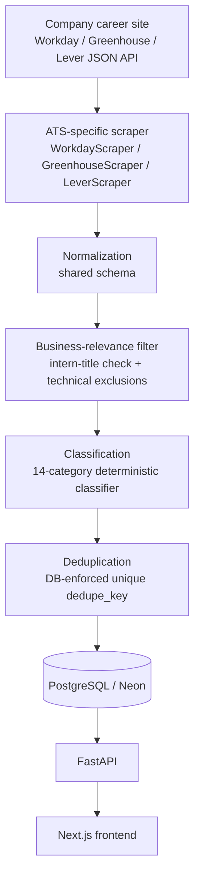

# Business Internship Aggregator

A production-deployed platform that aggregates business internships (Finance, Consulting, Marketing, Operations, and 10 other functions) from 73 major employers' career sites into one searchable, filterable interface — the kind of centralized aggregator that already exists for software engineering internships, but not for business ones.

## Live Demo

| | |
|---|---|
| App | https://business-internship-aggregator.vercel.app |
| API | https://business-internship-aggregator-api.onrender.com |
| API Docs (Swagger) | https://business-internship-aggregator-api.onrender.com/docs |

The API runs on Render's free tier, which sleeps after ~15 minutes of inactivity — the first request after a quiet period can take 30-50 seconds to cold-start. The frontend calls it directly, so the same delay shows up on your first page load if the app has been idle.

## What It Does

- **Aggregates** internship postings across 73 employers on 3 different ATS (applicant tracking system) platforms, without a single company-specific HTML scraper.
- **Normalizes** every posting — regardless of source platform — into one consistent schema.
- **Classifies** each posting into one of 14 business functions (Finance, Accounting, Consulting, Marketing, Operations, Supply Chain, Strategy, Human Resources, Sales, Business Analytics, Product Management, Real Estate, Legal, Other) using a deterministic, keyword-based classifier — not an LLM.
- **Filters out technical roles** (software engineering, data science, skilled trades) that don't belong on a *business* internship board, even when they're posted by the same companies.
- **Tracks posting lifecycle**: first-seen/last-seen timestamps, and postings that disappear from a company's career site are marked inactive automatically — never silently deleted.
- **Deduplicates** postings via a database-enforced uniqueness constraint, so the same role scraped twice never shows up twice.
- Serves it all through search, category/company/location/industry filters, sorting, and pagination.

## Production Snapshot

*As of 2026-09-06.* Job counts change continuously as the scraper runs every 6 hours — treat these as a representative snapshot, not a live-updating claim.

| Metric | Value |
|---|---|
| Employers integrated | 73 |
| Active internships | ~1,500 |
| Total tracked records (active + historical) | ~1,800 |
| Business function categories | 14 |
| ATS integrations | 3 (Workday, Greenhouse, Lever) |
| Automated tests | 126 |
| Scrape frequency | every 6 hours |
| Scheduler runtime | ~5-7 minutes |

For live, current numbers rather than a snapshot, the [API itself](https://business-internship-aggregator-api.onrender.com/companies) is the source of truth.

## Tech Stack

| Layer | Technology |
|---|---|
| Frontend | Next.js (App Router), TypeScript, Tailwind CSS |
| Backend | Python, FastAPI, Pydantic |
| Database | PostgreSQL (Neon), SQLAlchemy, Alembic |
| Scraping | Python, `requests` — no browser automation, since every integrated ATS exposes a JSON API |
| Automation | GitHub Actions (scheduled scraping + CI) |
| Auth | Clerk |
| Email | Resend |
| Testing | pytest (126 tests) |
| Deployment | Vercel (frontend), Render (backend), Neon (database) |

Deliberately simple: no microservices, no Kubernetes, no search index, no ML infrastructure. Nothing here needs it at this scale, and adding it would be over-engineering, not architecture.

## Architecture



Every company scraper is a small config file (tenant/board ID + a few identifying fields) that subclasses one of three shared ATS scrapers — not a one-off HTML scraper per company. Adding company #74 is almost always a config change, not new scraping logic. Full component breakdown, data lifecycle, and the reasoning behind each design choice: [`docs/architecture.md`](docs/architecture.md).

## Supported ATS Platforms

| Platform | Companies | Notes |
|---|---:|---|
| Workday | 65 | The large majority of Fortune 500-scale employers run Workday; one shared `WorkdayScraper` handles all of them via per-tenant config |
| Greenhouse | 7 | Public JSON board API, no auth needed |
| Lever | 1 | Same pattern — one shared integration, config-driven |

Representative employers (spanning Financial Services, Consumer Goods, Aerospace, Retail, Healthcare, Consulting, Real Estate, and more): Procter & Gamble, Target, General Motors, UPS, Citigroup, Wells Fargo, Capital One, Barclays, Deutsche Bank, JLL, PwC, Boeing, Airbus, The Walt Disney Company, Coca-Cola, Kraft Heinz, Merck, Vanguard, Robinhood, Cloudflare. Full current list: [`/companies`](https://business-internship-aggregator-api.onrender.com/companies) or `scrapers/company_registry.py`.

Beyond the 73 live integrations, the project maintains a researched registry of 299 target employers (`scrapers/company_registry.py`) — each with a priority tier, ATS platform, and verification status — used to prioritize which companies to build next. The registry is a research/planning tool, not a claim that all 299 are integrated. Several well-known employers were deliberately **not** built against after live verification found them blocked by bot-management systems (Avature-based career sites) or on ATS platforms with no accessible public API — see "Known Limitations" below.

## Data Pipeline

1. Fetch open postings from a company's ATS (a single whole-board fetch or a narrowed API query, depending on what that ATS's API supports).
2. Check whether the title is internship-shaped at all (`intern`/`internship`/finance's "summer analyst" convention).
3. Exclude technical/vocational roles that don't belong on a business board (software engineering, data science, skilled trades — checked by keyword, not by company).
4. Classify the surviving title into one of 14 business categories by longest keyword match; unmatched-but-legitimate business roles fall to **Other** rather than being force-fit.
5. Compute a normalized dedupe identity (company + normalized title + normalized location) and validate the record.
6. Insert new postings, update `last_seen_at` on existing ones.
7. After a **successful** scrape, any previously-active posting not seen in that run is marked inactive — a failed scrape never touches existing data.
8. Serve everything through the API and frontend.

## Classification

Deterministic and keyword-based — no LLM, no embeddings, no ML model. Each title is checked against an ordered set of category keywords; the **longest matching keyword wins** (so a specific phrase like "market research" beats a generic one like "strategy" on the same title). A separate exclusion list removes technical/vocational roles before classification even runs. One category — "Capital Markets" — is industry-scoped: the same two words mean real-estate investment sales at a real-estate firm but investment-banking capital markets at a bank, so that one rule additionally checks the posting company's industry rather than title text alone.

This approach was a deliberate choice over an LLM classifier: it's free to run at scale, every classification decision is traceable to a specific keyword (genuinely explainable, not just "the model said so"), and every rule that's ever been added or rejected is documented with the real postings that motivated it. See `scrapers/classification.py` and `docs/architecture.md` for the full rule set and rejected-rule history.

## Reliability

- **Per-company isolation**: one company's scraper failing (site redesign, API change, timeout) doesn't affect any other company's run.
- **Per-listing isolation**: a single malformed posting within a company's feed is skipped and logged, not fatal to that company's whole run.
- **Lifecycle safety**: a company's existing active postings are only ever marked inactive after that company's scrape *succeeds* — a failed run preserves everything as-is rather than wiping data based on incomplete information.
- **Idempotent notifications**: a database-level `UNIQUE` constraint (not application bookkeeping) guarantees a retried notification job can never send a duplicate email.
- **126 automated tests** covering classification, deduplication, lifecycle transitions, scraper-run metrics, the scheduler, and the API.

## Scalability

Measured, not estimated: the 73-company scheduler currently runs in ~5-7 minutes with 8 concurrent scrapers, against a 40-minute GitHub Actions budget. Linear extrapolation (safe given per-company cost is bounded, independent network I/O) puts 150-200 companies comfortably inside that same budget without any architecture change. No distributed infrastructure is needed at this scale, and building it preemptively would be effort spent on a problem that doesn't exist yet.

## Data Quality

Classification accuracy has been treated as an ongoing, evidence-driven process rather than a one-time build: every keyword rule (and every category, including the newest — Legal) exists because a full audit of real postings showed a recurring, unambiguous pattern, and every rule is checked against the *entire* active dataset for collisions before being added. Roughly a third of active postings remain in **Other** — genuinely ambiguous titles, insufficient information, or business functions too thin/company-specific to warrant a dedicated category — and that's treated as an honest result, not a metric to chase toward zero.

## Known Limitations

- Several major employers (e.g., IBM, CBRE) run career platforms (Avature) that return bot-management challenges to any non-browser client — not integrated, since bypassing that would require capabilities and access assumptions this project deliberately avoids.
- Bare "IT" and "data science" titles can't be safely excluded as technical roles without a deeper classifier restructure — a few genuine technical postings remain visible as a result. Documented, not silently ignored.
- Some ambiguous or company-specific titles (generic "Digital" practice names, rotational-program department names) stay in **Other** rather than being guessed into a category.
- Production database access is API-only from this project's tooling — there's no direct admin/SQL access outside Neon's own dashboard, so some verification (e.g., confirming zero duplicate keys in production) relies on the database's own `UNIQUE` constraint rather than a direct query.
- The 299-company registry is a research/prioritization tool, not a claim that all of them are integrated — only 73 are live today.

## Repository Structure

```text
frontend/           Next.js App Router pages + components + typed API client
backend/
  api/               FastAPI app, routes, response schemas, Clerk JWT verification
  models/            SQLAlchemy models
  services/          Email + notification-eligibility logic
scrapers/
  companies/         One small config class per integrated company (73)
  base_scraper.py     Shared lifecycle/dedupe/DB-write logic for every ATS
  workday.py, greenhouse.py, lever.py   Shared per-ATS fetch/parse logic
  classification.py   Title -> category classifier
  company_registry.py Researched employer pool + priority/verification tracking
  scheduler.py         Runs every company scraper (invoked by GitHub Actions)
alembic/             Schema migrations
tests/               126 pytest tests (classification, dedupe, lifecycle, API, scheduler)
docs/                Architecture, PRD, roadmap
```

## Running Locally

Requires PostgreSQL, Python 3.12+, and Node.js 20.9+.

```bash
# Backend
py -m venv .venv
.venv\Scripts\pip install -r requirements.txt
.venv\Scripts\python -m alembic upgrade head
.venv\Scripts\python -m uvicorn backend.api.main:app --reload
# API docs at http://127.0.0.1:8000/docs

# Populate real data by running any scraper directly, e.g.:
.venv\Scripts\python -m scrapers.companies.robinhood

# Frontend (separate terminal)
cd frontend && npm install && npm run dev
# App at http://localhost:3000

# Tests (requires the local Postgres setup above)
.venv\Scripts\python -m pytest tests/ -v
```

Copy `.env.example` → `.env` and `frontend/.env.example` → `frontend/.env.local` first — each file documents what every variable is for inline. Full environment variable reference, example API requests, and production deployment setup (Vercel/Render/Neon/GitHub Actions): see "Production Architecture" in [`docs/architecture.md`](docs/architecture.md).

## Project Status

**Production-deployed and actively maintained.** Core pipeline (scraping, normalization, classification, deduplication, lifecycle tracking), search/filter/sort, user accounts, saved internships, and email notifications are all live. See [`docs/roadmap.md`](docs/roadmap.md) for the full phase-by-phase build history.

## Documentation

- [Architecture](docs/architecture.md) — component design, data lifecycle, and the reasoning behind every major technical decision
- [Product Requirements](docs/PRD.md) — original problem framing and MVP scope
- [Roadmap](docs/roadmap.md) — phase-by-phase build history
