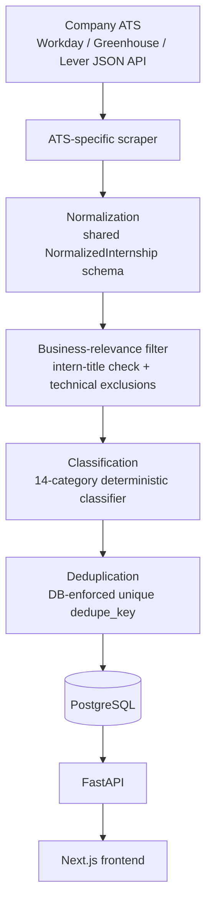

# Architecture Overview

This document describes the technical architecture as actually built and deployed to production (73 companies, 14 categories, Phase 10 Step 9 as of last major revision — see `roadmap.md` for phase-by-phase build history). The sections below describe the current system; "Implementation Notes" further down is a chronological log of how and why each piece was built, kept for engineering-decision history rather than as the primary reference.

**Note on scope:** the original MVP plan (written before any code existed) called for Playwright-driven browser scraping of each company's career site individually. That never shipped, on purpose: every ATS platform actually integrated (Workday, Greenhouse, Lever) turned out to expose a public, unauthenticated JSON API, which is simpler, faster, and far less fragile than browser automation against arbitrary HTML. Playwright remains listed as a possible future dependency only if a high-value employer is found on a JSON-API-less platform; none has been implemented against it, and it isn't in `requirements.txt`.

## High-Level Flow



## Component Responsibilities

### Frontend (Next.js + React + Tailwind CSS)

Presents internship data and translates user interaction into API calls: a searchable/filterable list, internship and company detail pages, category/company/location/industry filters, sorting, pagination, saved internships, and notification preferences (for signed-in users). The frontend holds no business logic beyond presentation and query construction — search, filtering, classification, and the "US & Canada" geographic display heuristic all live server-side; the one piece of client-computed state is the dynamic result-summary count (company/category counts for the *currently filtered* result set), computed from the same array the results list already renders from so it can never disagree with what's on screen.

### Backend (FastAPI)

Exposes internship, company, and category data over a REST API: search (keyword), filters (category/company/location/industry), sorting, pagination, plus authenticated endpoints for saving internships and managing notification preferences. Verifies each authenticated request's session token independently against Clerk's JWKS rather than trusting the frontend's auth state. Does not scrape — it only reads from (and, for saves/preferences, writes to) the database that the scraper pipeline populates.

### Database (PostgreSQL)

Single source of truth — no separate cache or search index. Stores internship postings (title, description, category, location, application/source URLs, `first_seen_at`/`last_seen_at`, `is_active`, a unique `dedupe_key`), company metadata (name, career URL, industry, ATS-derived config), and the user-facing tables (users, saved internships, notification preferences/events) added in the accounts phase. Schema changes only ever happen through Alembic migrations — `database/schema.sql` is a human-readable reference copy, not something applied directly.

### Scrapers (`scrapers/companies/`)

Each of the 73 integrated companies is a small config class (tenant/board identifier, career URL, industry, and — for Workday — an optional facet ID to narrow the fetch) that subclasses one of three shared ATS scrapers. There is no per-company HTML parsing logic; the site-specific work was done once, per ATS platform, not once per company. See "Scraper Hierarchy" below.

### `base_scraper.py`

Defines the shared lifecycle every ATS scraper follows: fetch raw listings → parse each into a `NormalizedInternship` (or skip it, e.g. non-internship titles or excluded technical roles) → compute a dedupe key → insert or update → after a successful fetch, deactivate any of that company's postings not seen in this run. Per-listing parsing errors are caught and logged without aborting the company's run; per-company errors are caught by the scheduler without aborting other companies' runs.

### Scheduler (`scrapers/scheduler.py`)

Runs all 73 company scrapers through a bounded thread pool (`MAX_PARALLEL_SCRAPERS = 8`), independently of each other, then reports per-company success/failure. This is the entry point both for local manual runs and for the scheduled GitHub Actions job — no external job queue or long-running process.

## Scraper Hierarchy

```text
BaseScraper (shared lifecycle, DB writes, dedupe, lifecycle reconciliation)
├── WorkdayScraper   (65 companies)
├── GreenhouseScraper (7 companies)
└── LeverScraper      (1 company)
        ↑
   scrapers/companies/*.py — one small config class per company
```

This hierarchy is why adding company #74 is almost always a config change (tenant name, board token, a few identifying fields) rather than new code: the fetch/parse/normalize/dedupe logic for a given ATS was written once and is shared by every company on that platform. A new ATS platform (there have been exactly 3 in this project's history) is the only case that requires writing new scraper logic — and that's treated as a real architectural decision, not a routine addition (see "Failure Model" below and the ATS-research notes in "Implementation Notes").

## Data Lifecycle

```text
new posting                    → insert, is_active = true
existing posting, still open   → update last_seen_at
existing posting, not in       → mark is_active = false
  this run's results             (only after that company's fetch succeeded)
previously-inactive posting     → reactivate (is_active = true again)
  reappears
company's scrape fails          → that company's existing records are
  outright                        left untouched — no deactivation happens
                                   without a successful fetch to justify it
```

This is a deliberate correctness property, not an incidental one: a transient network error or a temporary API change must never be interpreted as "every posting at this company just closed." Deactivation only happens when the scraper actually saw a complete, successful result set that no longer contains a given posting.

## Deduplication

Identity is a normalized `(company_id, title, location)` triple, hashed into a `dedupe_key` column with a database-level `UNIQUE` constraint — not application-level bookkeeping, so a race or a bug in the upsert logic can't silently create a duplicate; it would raise an `IntegrityError` instead. This was chosen over the source URL as the natural key because some ATS platforms rotate posting URLs on re-post without the underlying role changing. A known long-term alternative — using the ATS's own internal posting ID where available — hasn't been necessary yet and isn't currently planned as a migration; the current approach has produced zero duplicate keys across every verification pass to date.

## Classification

Deterministic, not ML: an ordered list of `(category, keyword)` pairs, checked via word-boundary regex against the normalized title, with the **longest matching keyword winning** when a title matches more than one. A separate exclusion list removes technical/vocational titles (software engineering, data science, skilled trades) before classification runs at all. One rule is industry-scoped rather than purely title-based: "Capital Markets" means real-estate investment sales at a real-estate services firm but investment-banking capital markets at a bank, so that rule additionally checks the posting company's `industry` field — the only place industry context feeds into classification, added specifically because a global keyword in either direction would have misclassified the other meaning. Every keyword — including the newest category, Legal — was added only after auditing real postings and checking the *entire* active dataset for collisions; several proposed rules were investigated and deliberately rejected when that check found a real regression risk (see "Implementation Notes (Phase 10 Step 9)").

## Failure Model

| Failure | Handling |
|---|---|
| Network error fetching one company's listings | Caught by that company's `run()`; logged; other companies unaffected; that company's existing data untouched |
| Malformed individual listing (missing field, unparseable date) | Caught in `parse_listing`; that listing skipped; rest of the company's run continues |
| A whole company's ATS blocked/changed/down | Scheduler catches the exception, marks that company failed for this run, continues to the next company |
| GitHub Actions job itself times out mid-run | Each company's `run()` commits its own transaction, so a mid-run cancellation can only lose that cycle's update for whichever company was in flight — never a partial write |
| Notification send fails | That send's events are marked `FAILED` (never `SENT`); not retried automatically within the same run, visible for manual investigation |

## Scaling

Measured (not estimated): 73 companies via 8 concurrent scrapers currently runs in ~5-7 minutes against a 40-minute GitHub Actions budget. See "Implementation Notes (Phase 10 Step 8)" for the linear-extrapolation reasoning behind why this holds toward ~200 companies without an architecture change.

## Out of Scope (Deliberately)

- No microservices — the backend is a single FastAPI application.
- No Kubernetes or container orchestration.
- No distributed job queue — a GitHub Actions cron + thread pool is sufficient at this scale.
- No search index (e.g., Elasticsearch) — PostgreSQL's own query capabilities are sufficient at this data volume.
- No ML/LLM classification — see "Classification" above for why deterministic keyword matching was chosen deliberately, not as a placeholder for something more sophisticated later.

---

# Implementation History

Everything below is a chronological log, written at the time each phase shipped — kept because it documents *why* each decision was made (including proposals that were investigated and rejected), which is often more useful in an interview than the current-state summary above. It is not required reading to understand the system; the sections above are.

## Implementation Notes (Phase 1 — Database)

The concrete schema is defined in [`database/schema.sql`](../database/schema.sql) and mirrored by SQLAlchemy models in `backend/models/`. Two tables: `companies` and `internships`, with a one-to-many relationship (a company has many internships; `internships.company_id` uses `ON DELETE RESTRICT` so a company can't be hard-deleted while historical internship data still references it — use `companies.is_active` instead).

Duplicate internships are prevented via a `dedupe_key` column — a hash of `company_id + normalized(title) + normalized(location)` computed in `backend/database/utils.py`, not a raw URL (career-site URLs often carry session/tracking parameters that vary between scrapes of the same posting). Full reasoning is documented alongside the schema in `schema.sql`.

Database access uses synchronous SQLAlchemy (`backend/database/session.py`) and Alembic for migrations (`alembic/`), both configured via the `DATABASE_URL` environment variable — never hardcoded credentials.

## Implementation Notes (Phase 2 — Scraping MVP)

`scrapers/base_scraper.py` defines `BaseScraper`, an abstract class shared by every company scraper. A subclass implements only two methods — `fetch_raw_listings()` (however the site needs to be reached) and `parse_listing(raw)` (turn one raw item into a `NormalizedInternship`, defined in `scrapers/schemas.py`, or return `None` to filter it out). `BaseScraper.run()` handles everything else identically across companies: looking up or creating the `Company` row, computing each listing's `dedupe_key` via the existing `compute_dedupe_key()`, inserting new internships or updating existing ones (bumping `last_seen_at`/`is_active`), isolating per-listing parse errors so one bad record can't crash a run, and logging a summary.

`fetch_raw_listings()` is deliberately not tied to Playwright — a subclass uses whichever transport fits the target site. A future company without a public API (e.g. many Workday-hosted career sites) would implement `fetch_raw_listings()` with Playwright instead, in the same slot, without touching `BaseScraper`.

## Implementation Notes (Phase 2B — Multi-Company Validation)

Adding a second and third company (Cloudflare, Braze) confirmed that Greenhouse's raw JSON schema (title, location, offices, departments, absolute_url, content, first_published, application_deadline) is identical across companies, so `scrapers/greenhouse.py` now provides a shared `GreenhouseScraper(BaseScraper)` that implements `fetch_raw_listings()` and `parse_listing()` once. Individual company files (`scrapers/companies/robinhood.py`, `cloudflare.py`, `braze.py`) are now just config — `board_token`, `company_slug`, `company_name`, `career_url`, `website_url` — with no fetch/parse logic of their own. This wasn't abstraction for its own sake: it replaced what would otherwise have been three near-identical copies of the same fetch/parse code, and it directly fixed a real bug (see below). A hypothetical future ATS without a public API (e.g. Workday) would get its own `WorkdayScraper(BaseScraper)` sibling, not a subclass of `GreenhouseScraper`.

Title-to-category classification was factored out into `scrapers/classification.py` (`classify_internship()`), shared by `GreenhouseScraper` and reusable by any future ATS-specific scraper, since classification is about job-title semantics, not how the data was fetched. Testing against real data from three companies drove two concrete fixes:
- **Specific phrases now outrank generic ones.** Robinhood's "Market Research Strategy Intern" was landing in *Strategy* rather than *Business Analytics*, purely because "strategy" appeared earlier in the keyword list than "market research". Category matching now picks the *longest* matching keyword phrase, not the first one in list order.
- **A missed exclusion.** Cloudflare's "Research Engineer Intern" postings weren't caught by the existing technical-role exclude list (which had "software engineer" etc. but not "research engineer") and would have been miscategorized as a business internship. Added.

Two findings were deliberately *not* papered over:
- Cloudflare's "GRC Team Intern" (governance/risk/compliance) doesn't fit any of the platform's 11 fixed categories and correctly falls back to `Other` rather than being force-matched to something misleading.
- Braze's "Business Development Representative Intern" is a sales/BD role with no matching category (`Other` again) — a real gap in the category taxonomy, not a bug. Worth considering a `Sales`/`Business Development` category in a future phase; not added here since it would require changing the `internship_category` Postgres enum, out of scope for this validation pass.

Also fixed: Cloudflare's `location.name` field is a generic placeholder ("In-Office") rather than a real place, while `offices[0].name` reliably holds the actual city. `GreenhouseScraper` now prefers `offices` when present. This wasn't cosmetic — two Cloudflare "Network Strategy Intern" postings share an identical title but have different real offices (London vs. Austin, TX); without this fix both would have normalized to the same location and collapsed into a single `dedupe_key`, silently dropping one of two genuinely distinct open roles.

## Implementation Notes (Phase 3 — FastAPI Backend)

```text
Scrapers  →  PostgreSQL  →  FastAPI  →  Next.js Frontend
```

The API layer (`backend/api/`) is a thin, read-only presentation layer over the database — it owns no business logic that the scrapers or database don't already own. Its responsibilities are: translate HTTP query parameters into validated SQLAlchemy queries, shape ORM objects into public response schemas (so internal-only fields like `dedupe_key` are never exposed), and return clean HTTP semantics (404s, 422s) instead of leaking database internals.

- `backend/api/main.py` — the FastAPI app: CORS (origin list from `CORS_ALLOWED_ORIGINS`), a global handler that turns any `SQLAlchemyError` into a generic 500 (never exposing SQL or connection details), and router registration.
- `backend/api/dependencies.py` — `get_db()`, a request-scoped SQLAlchemy session (reuses the existing `backend/database/session.py` engine; no second database connection system).
- `backend/api/schemas/` — Pydantic response models (`InternshipOut`, `CompanyOut`, etc.), built with `from_attributes=True` so they validate directly off ORM objects. Categories are never redefined here — `GET /categories` reads `InternshipCategory` directly from `backend/models/internship.py`.
- `backend/api/routes/` — `internships.py` (list with search/filter/sort/pagination, detail), `companies.py` (list with an active-internship count via a correlated subquery, detail with its active internships), `categories.py`.

Every internship list/detail query does a single `JOIN` to `companies` with `contains_eager()` to load the company alongside each internship in one query, avoiding an N+1 query per internship. The company list's `active_internship_count` uses a correlated scalar subquery for the same reason — one query total, not one count query per company.

Search (`?search=`) and the `location=`/`company=` filters use PostgreSQL `ILIKE` for case-insensitive partial matching — no Elasticsearch, no raw SQL string interpolation (all values are bound parameters via SQLAlchemy's query builder). `category` and `sort` are validated against fixed enums by FastAPI/Pydantic, so an invalid value returns a 422 with the list of accepted values rather than silently returning nothing.

## Implementation Notes (Phase 4 — Next.js Frontend)

```text
Career Sites → Scrapers → PostgreSQL → FastAPI → Next.js → User
```

The frontend (`frontend/`, Next.js App Router + TypeScript + Tailwind) is a thin presentation layer: it owns no filtering/search/sort logic of its own — every one of those operations is a query parameter sent to the existing FastAPI endpoints, never client-side data manipulation.

**Server-first architecture.** The home page (`app/(home)/page.tsx`) and both detail pages (`app/internships/[id]/page.tsx`, `app/companies/[id]/page.tsx`) are async Server Components that read the URL (search params or route params), call the typed API client (`frontend/lib/api.ts`), and render server-side — there is no client-side data fetching, loading spinners driven by `useEffect`, or duplicate requests. The URL is the single source of truth for search/filter/sort/page state (Step 12): interactive controls (`SearchBar`, `FilterPanel`, `SortSelect` — the only Client Components, marked `"use client"`) don't hold their own request state, they just read the current URL via `useSearchParams()`, merge in a change, and `router.push()` a new URL, which re-renders the server page. `Pagination` needs no client JS at all — it's a Server Component rendering plain `<Link>`s with hrefs computed from the current query params.

`frontend/lib/api.ts` centralizes every backend call (`getInternships`, `getInternship`, `getCompanies`, `getCompany`, `getCategories`) behind a typed client that builds query strings via `URLSearchParams` (never raw string concatenation) and always fetches with `cache: "no-store"`, since internship data changes as scrapers run. `frontend/lib/types.ts` mirrors the Pydantic response schemas by hand (no codegen — small enough surface area that keeping them manually in sync is simpler than adding a generator dependency).

**Loading and error states use Next.js's own file conventions** rather than manual state management: a route-level `loading.tsx` is shown automatically while a Server Component awaits data, and `error.tsx` is a React error boundary that catches thrown fetch failures and offers a "Try again" button (via the `reset()` callback Next.js provides). `notFound()` (from `next/navigation`) triggers `not-found.tsx` for a missing internship or company ID.

One consequence of this required a deliberate fix: a `loading.tsx` file makes Next.js wrap that route in a `<Suspense>` boundary, and per Next.js's own documentation, once a Suspense-wrapped response starts streaming as `200 OK`, calling `notFound()` deeper in the tree can no longer change the HTTP status code (it's already been sent) — the not-found *content* still renders correctly, but the status stays `200`. This was caught by testing (`curl` showed `200` for `/internships/999999`), not assumed away. The fix: only the home page needs a loading skeleton, so `loading.tsx` was scoped to a `(home)` route group containing just the home page. The two detail pages have no `loading.tsx` ancestor, so they render as fully blocking dynamic routes and return correct status codes — verified via `curl`: `404` for a missing internship/company ID, `500` (via `error.tsx`) when the backend is unreachable.

**Verified via `curl` against the live backend** (no browser available in this environment): status codes for all routes (200/404/500), search/category/company/location filters and their combination, sorting, pagination links, URL-param round-tripping (search input `value` reflects `?search=`), the Apply button's `href` matching the internship's real `application_url`, and empty/error state content. **Not verifiable without a browser**, and therefore not claimed as tested: actual visual responsive layout on mobile/tablet, click/keyboard interaction, focus-visible styling, and the exact client-side transition/pending-state behavior (`useTransition`) — these follow standard, deliberately-chosen Tailwind responsive utilities and accessibility patterns (semantic HTML, `<label>`s, `sr-only` text, `aria-current`/`aria-disabled` on pagination) but are unverified beyond code review and a successful production build (`npm run build`, zero TypeScript errors).

## Production Architecture (Phase 6 — Deployment)

```text
Company Career Websites
        ↓
     Scrapers (scrapers/scheduler.py)
        ↓
   GitHub Actions (scheduled every 6h + workflow_dispatch)
        ↓
  Managed PostgreSQL (Neon)
        ↑ (also read by)
     FastAPI (Render)
        ↓
     Next.js (Vercel)
        ↓
       User
```

**Frontend hosting (Vercel).** `frontend/` deploys automatically on push to `main`. Vercel's Root Directory is set to `frontend` so the Next.js app builds independently of the Python backend in the same repo. `NEXT_PUBLIC_API_BASE_URL` is a Vercel project environment variable pointing at the Render API URL — never hardcoded, per the existing `frontend/lib/api.ts` pattern of reading it from `process.env`.

**Backend hosting (Render).** A single free Web Service, deployed via the `render.yaml` Blueprint at the repo root (infrastructure-as-code, so the service configuration itself is versioned). Build command installs `requirements.txt`; start command runs `alembic upgrade head && uvicorn backend.api.main:app --host 0.0.0.0 --port $PORT` — migrations apply automatically on every deploy (idempotent, so this is safe to run repeatedly), and there is no `--reload` or debug flag. Render's own health check hits `GET /`. `DATABASE_URL` and `CORS_ALLOWED_ORIGINS` are Render environment variables (`sync: false` in `render.yaml`, meaning Render prompts for them in its dashboard rather than storing values in the repo).

**Database hosting (Neon).** Managed serverless Postgres, free tier. The production schema was created exclusively through `alembic upgrade head` run against the Neon connection string — no manual DDL — and verified to match the local schema exactly (tables, indexes, the `internship_category` enum, and the `internships.company_id` `ON DELETE RESTRICT` foreign key). Neon's pooled connection string (the `-pooler` host) is used since both Render and GitHub Actions connect intermittently rather than holding a persistent connection pool of their own.

**GitHub Actions (`.github/workflows/scraper.yml`).** Runs on a `0 */6 * * *` cron (every 6 hours, UTC) and via manual `workflow_dispatch`. Steps: checkout → Python 3.12 → `pip install -r requirements.txt` → `alembic upgrade head` → `python -m scrapers.scheduler`. A `concurrency` group prevents overlapping runs (a manual trigger racing a scheduled one) from writing to the database at the same time. `DATABASE_URL` is a GitHub Actions repository secret, referenced via `${{ secrets.DATABASE_URL }}` and never printed to logs.

**Scraper execution.** `scrapers/scheduler.py` is the entry point both locally and in CI: it runs the full list of company scraper classes (73 as of Phase 10 Step 9 - see "Scraper Hierarchy" below) through a bounded thread pool (`MAX_PARALLEL_SCRAPERS = 8`, added in Phase 10 Step 5 once sequential execution started approaching the GitHub Actions timeout). One company's scraper raising an exception outright (e.g. its API is unreachable) is caught, logged, and skipped — it does not stop the other companies' scrapers, and because each `BaseScraper.run()` commits its own transaction, a failed company never leaves partial writes. Within a single company's run, `BaseScraper.run()` also reconciles lifecycle state: any internship still marked active in the database but absent from that run's fetched listings is set `is_active = False`. This only runs after a successful fetch, so a scraper that fails before returning any listings can never mass-deactivate a company's postings.

**Environment variables and environment separation.** Local development reads `.env` (backend, via `python-dotenv`) and `frontend/.env.local` (frontend), both gitignored. Production configuration is split across three separate surfaces that all happen to reference the same values: Render environment variables (used by the live API process), Vercel environment variables (used at frontend build/runtime), and GitHub Actions repository secrets (used by the scheduled scraper job). No production credential is ever committed, logged, or printed — verified against the full git history, not just the current `.gitignore`.

| Variable | Where | Purpose |
|---|---|---|
| `DATABASE_URL` | `.env`, Render, GitHub Actions | PostgreSQL connection string |
| `CORS_ALLOWED_ORIGINS` | `.env`, Render | Comma-separated allowlist of origins permitted to call the API — never a wildcard |
| `NEXT_PUBLIC_API_BASE_URL` | `frontend/.env.local`, Vercel | Base URL the frontend calls |
| `CLERK_JWKS_URL`, `CLERK_SECRET_KEY` | `.env`, Render | Backend verifies session tokens independently against Clerk's JWKS; the secret key is used only for one-time email lookups on first sign-in |
| `NEXT_PUBLIC_CLERK_PUBLISHABLE_KEY`, `CLERK_SECRET_KEY` | `frontend/.env.local`, Vercel | Next.js's own Clerk SDK — a separate use of the secret key from the backend's |
| `RESEND_API_KEY`, `NOTIFICATIONS_FROM_EMAIL` | `.env`, Render, GitHub Actions | Email provider for the notification digest job |
| `FRONTEND_BASE_URL` | `.env`, Render | Builds internship detail-page links inside notification emails |

**Production vs development.** The only difference in application code between environments is which values the existing env-var reads resolve to — there is no separate "production mode" branch of logic, no feature flags, and no hardcoded environment-specific URLs anywhere in the codebase.

## Implementation Notes (Phase 7 — Scraper Expansion & Data Quality)

Goal: prove the scraper architecture generalizes beyond three same-ATS companies, and tighten data quality now that there's enough real, varied data to find its actual weak points.

### Scraper Architecture

```text
BaseScraper
├── GreenhouseScraper
│   ├── Robinhood, Cloudflare, Braze (Phase 2/2B/5)
│   └── Rocket Lab, SpaceX, Red Ventures, SpotHopper (Phase 7)
└── WorkdayScraper
    └── Abbott Laboratories (Phase 7)
```

**WorkdayScraper (`scrapers/workday.py`)** is the platform's first non-Greenhouse ATS integration. Like Greenhouse, Workday's own career-site frontend calls a public, unauthenticated JSON API (`/wday/cxs/{tenant}/{site}/jobs`) - no authentication, CAPTCHA, or anti-bot measure is bypassed; confirmed against each tenant's own `robots.txt` (Abbott's explicitly `Allow: /abbottcareers/`, disallowing only `/nonpublic/` and `/refreshFacet/`). The practical difference from Greenhouse is volume: Greenhouse returns an entire company's board in one request, while Workday paginates at a hard-capped 20 results per page and only returns a title/location summary per job, requiring a second per-job request for the full description. To keep request volume proportionate (a large global employer like Abbott has ~2,000 open roles total), `WorkdayScraper` narrows the query server-side to Workday's own `workerSubType` facet for "Intern/Student" postings - a GUID specific to each tenant, found once via that tenant's own facet listing and set as `intern_facet_id` in the company config - and further pre-filters by title (`INTERN_TITLE_RE`) before paying for the second request. This cut Abbott's per-run request count from thousands to about 40. A company config only sets `base_url`/`tenant`/`site`/`intern_facet_id` plus the usual `BaseScraper` fields; all fetch/pagination/parsing logic is shared, mirroring how `GreenhouseScraper` factors out its ATS-specific equivalent.

**Shared utilities (`scrapers/http_utils.py`, `scrapers/text_utils.py`).** Both ATS scrapers now share one retry/backoff-configured `requests.Session` (3 retries, exponential backoff, retrying only transient failures - connection errors, timeouts, HTTP 429, and temporary 5xx - never a permanent 404) and one set of HTML-description-cleaning / date-parsing / location-normalization helpers, rather than each ATS module reimplementing them.

### Classification Quality

Company expansion immediately surfaced two real, previously-latent bugs in `scrapers/classification.py`, both fixed and covered by regression tests in `tests/test_classification.py`:

1. **Substring false positives.** The original keyword matching was a plain `keyword in title.lower()` substring check. Adding a `Sales` category with the keyword `"sales"` would have miscategorized a hypothetical "Salesforce Administrator Intern" as Sales, since "sales" is a literal substring of "Salesforce". Matching was rewritten to compiled word-boundary regexes (`_keyword_pattern`) - a leading `\b` on every keyword, computed once per keyword at module load rather than per title. A small, explicit exception (`_PREFIX_MATCH_PHRASES`) drops the *trailing* boundary only for the two phrases that must also match as a prefix of a longer word ("engineering intern" needs to match "...Engineering **Internship**" too).
2. **Technical roles leaking into OTHER.** The original `EXCLUDE_KEYWORDS` list only covered software-engineering terms, so aerospace-hardware internships from Rocket Lab and SpaceX (Avionics, Manufacturing Engineering, Flight Software, Civil/Silicon Engineering, etc.) were falling into `OTHER` as if they were unclassified *business* roles - misleading, since `OTHER` is meant to mean "a real business function without a fixed category," not "a technical role that slipped past the filter." `EXCLUDE_KEYWORDS` gained several targeted additions, each tied to a real observed title (see comments in `classification.py`).

**New category: Sales.** Braze's "Business Development Representative Intern" (Phase 5), Abbott's "Commercial Excellence Intern", and SpotHopper's "Business Development Internship" (Phase 7) are real, recurring postings across three companies with no existing category to land in - a legitimate taxonomy gap per the project's own stated principle ("do not force jobs into incorrect categories simply to avoid Other"), not a one-off. Added end-to-end: Postgres enum (`ALTER TYPE internship_category ADD VALUE 'Sales'`), SQLAlchemy enum, `scrapers/classification.py` keywords, `frontend/lib/types.ts`. No backend API or frontend filter-component code needed to change - both already read the category list dynamically (`GET /categories` reads the enum directly; `FilterPanel` renders whatever that endpoint returns).

**HR keyword gap.** Rocket Lab's "Learning & Development Intern" is a real, standard HR sub-function with no existing synonym in the `HUMAN_RESOURCES` keyword list; added `"learning & development"` / `"learning and development"`.

### Data Quality Validation

`scrapers/schemas.py` now has `validate_normalized_internship()`, called in `BaseScraper.run()` after `parse_listing()` succeeds and before the listing is upserted. It checks: non-empty title (and within the `VARCHAR(500)` column limit), `application_url`/`source_url` are absolute HTTP(S) URLs, and `application_deadline` isn't before `posted_date`. A listing that fails validation is logged with the specific reason and skipped (counted in `error_count`), never silently dropped and never crashing the run - the same isolation pattern already used for per-listing parse errors. Category validity is already guaranteed by the type system (`NormalizedInternship.category: InternshipCategory` - an invalid value fails at construction, inside the existing per-listing `try/except`), so it isn't re-checked here. Location normalization (whitespace collapsing) and description cleaning (HTML-to-text) happen earlier, in the shared `text_utils` helpers every ATS scraper's `parse_listing()` calls.

### A Real Dedup Collision, Found by Testing

`database/schema.sql`'s "Deduplication Strategy" section always documented a known limitation: `dedupe_key = hash(company_id + normalized(title) + normalized(location))` cannot distinguish two genuinely different postings that happen to share an identical title and location. This had never actually been hit until Rocket Lab was added: it runs two distinct open reqs both titled "Business Analyst Intern - Supply Chain" at the same "Auckland Production Complex Office" location. The first local test run crashed the entire company's scraper run on a Postgres unique-constraint violation (both rows landed in the same `INSERT` batch). Rather than redesigning the dedupe strategy (out of scope - the existing key intentionally avoids raw URLs, since ATS URLs carry tracking/session parameters that vary between scrapes of the same real posting), `BaseScraper.run()` now detects a same-run key collision before attempting the insert, logs it clearly (surfaced in both `ScraperRunResult.errors` and the persisted `scraper_runs.error_count`), and skips the second listing - so one of the two real postings is known to be represented, not silently lost, and the run completes instead of crashing. This is a direct, honest consequence of the documented dedup tradeoff, not a new bug.

### Scraper Run Metrics

A new `scraper_runs` table (`backend/models/scraper_run.py`, migration `dfdc769405fd`) persists one row per company-scraper invocation: `company_slug`, `scraper_name`, `started_at`/`completed_at`, `status` (`success`/`failed`), and the same counts already tracked in-memory by `ScraperRunResult` (`raw_count`, `relevant_count`, `created_count`, `updated_count`, `deactivated_count`, `skipped_count`, `error_count`), plus a truncated `error_message` on failure. `BaseScraper._record_run()` writes this row in a dedicated short-lived session, independent of the main working session, so a run's outcome is recorded even when that session was never opened (a fetch-level failure) or already closed - deliberately not sharing the working session, so a metrics-write is never coupled to the success/failure of the actual scrape it's describing. Not exposed through the public API (Phase 7 Step 18 - internal operational data only); query it directly against the database for now.

### Error Handling

`BaseScraper.run()` distinguishes three failure classes, all logged with company/scraper/error-type context and never including secrets: (1) a fetch-level failure (network/HTTP, after `http_utils`' retry policy is exhausted) - the whole company run fails, nothing has been written yet; (2) a database-processing failure (e.g. a constraint violation) - also a hard failure, logged separately since the fetch itself succeeded; (3) a per-listing parse or validation failure - isolated, logged, counted, and skipped without affecting the rest of that company's run. All three record a `scraper_runs` row.

## Implementation Notes (Phase 8 — Dataset Expansion & Product Polish)

Goal: prove the platform's usefulness scales past a thin, tech/aerospace-skewed dataset, and make the frontend feel like an actual discovery product rather than a raw search form.

### ATS Architecture: Lever

```text
BaseScraper
├── GreenhouseScraper  (7 companies)
├── WorkdayScraper     (8 companies)
└── LeverScraper       (HCVT)
```

`LeverScraper` (`scrapers/lever.py`) is the platform's third ATS, added only after confirming a real, verified need: HCVT (a tax/accounting/advisory firm) had 12 clean, currently-open Accounting/Consulting internships across distinct offices, with no dedup-collision risk. It uses Lever's own officially documented, unauthenticated Postings API (`api.lever.co/v0/postings/{site}` - see `github.com/lever/postings-api`, maintained by Lever), explicitly designed for public career-site/job-board consumption - architecturally the simplest of the three ATSs, since one request returns a company's entire posting list already (like Greenhouse, unlike Workday's per-job detail requests). A specific access question came up during evaluation and is worth recording: `jobs.lever.co` (Lever's separate hosted-posting-page domain) has a robots.txt rule disallowing `ClaudeBot` specifically, distinct from its generic `Allow: /` for other bots; `api.lever.co` (the only host this scraper ever talks to) carries no such restriction. The distinction was treated as meaningful rather than a loophole - confirmed the Postings API is Lever's own sanctioned public interface (not reverse-engineered), and the scraper never touches `jobs.lever.co` or Lever's separate authenticated OAuth Data API.

### Company Industry Metadata

`Company.industry` (nullable `VARCHAR(100)`, migration `dda83df7adaa`) is free text, not a fixed enum - unlike `internship_category`, the set of industries is expected to grow organically as companies are added, and a rigid taxonomy would need its own migration every time a new industry showed up. Each company config sets `industry` as a class attribute (e.g. `industry = "Healthcare"`); `BaseScraper._get_or_create_company()` sets it on creation and refreshes it on every subsequent run if the config value changes, so the 8 companies that predated this field were backfilled automatically on their next scheduled run rather than needing a one-off data migration script. Exposed via `GET /internships?industry=` (exact match, joined through `Company`) and surfaced in `CompanySummary`/`CompanyOut` - no new endpoint was added; the frontend derives its industry filter options from the existing `GET /companies` response.

### Classification: Real Estate Category and Further Refinements

All changes here were driven by titles actually observed from the 8 new companies, following the same evidence-based bar as Phase 7:

- **New `Real Estate` category** - Invesco's recurring "Early Career Intern - Real Estate (Equity & Credit)" postings, explicitly suggested as a candidate category in this phase's own task definition and backed by real, repeated volume.
- **Finance keywords**: `investment(s)`, `risk`, `actuarial`, `equity`/`equities` - Invesco (investment management) and AIA (insurance/actuarial) postings that don't fit any other category cleanly enough to justify their own new category yet (too little distinct volume, per the "only add a category if there are enough real postings" rule applied in Phase 7).
- **Accounting keyword**: `tax` - HCVT's Tax/International Tax/State and Local Tax internships.
- **A real regex bug, found by testing**: Medtronic's "Cardiovascular _Marketing Intern" (a stray underscore from a messy ATS export) did not match `\bmarketing\b`, because regex word-boundaries treat `_` as a word character - the character immediately before "marketing" was never a boundary. Fixed by normalizing separator punctuation (`_`, `/`) to spaces before matching (`_normalize_for_matching` in `classification.py`), rather than special-casing this one title.
- **Broadened technical exclusions** per this phase's explicit list: `mechanical engineer`, `electrical engineer`, `computer engineer`, `embedded engineer`/`embedded systems`, `cyber security`, `it intern`.
- **The Phase 7 dedup-collision handling was exercised for real, repeatedly**: AIA and Medtronic both post multiple identical-title-and-location openings (e.g. AIA's "Intern, Testing" appears 4 times at the same Kuala Lumpur office). Each collision was skipped and logged exactly as designed - confirmed this generalizes beyond the single Rocket Lab case that originally motivated it, not a new bug.
- **`Other` is 48/118 active internships (~41%) in production as of this phase** - slightly higher than Phase 7's 34%, not lower, despite the additions above. This is disclosed rather than smoothed over: AIA and Medtronic between them contribute a large volume of generically- or internally-titled international postings (e.g. "Agency, Intern", "Intern, Process Transformation", "NMPH Operation Intern") that are genuinely ambiguous - forcing them into a specific category to shrink the `Other` percentage would violate the platform's own stated principle against forced classification.

### Freshness

Two different timestamps answer two different questions, and the platform is deliberately careful never to conflate them (Phase 8 Step 9's core requirement): `Internship.posted_date` is the source's own claim about when the role went live (not every ATS provides one - Workday's job detail response omits an application deadline entirely, for instance, and some sources' dates are approximate); `Internship.first_seen_at` is strictly this aggregator's own observation - when a scraper run first inserted the row, never adjustable by source data. `frontend/lib/format.ts`'s `freshnessLabel()` shows "Posted X ago" when a real `posted_date` exists, and falls back to "Discovered X ago" (from `first_seen_at`) only when it doesn't - the copy itself signals which kind of date is being shown, so a listing missing a source date is never presented as if the platform knew when it was actually posted. The "New" badge (`isNewlyDiscovered()`) is intentionally always based on `first_seen_at` (≤ 7 days), not `posted_date`, since discovery time is the one signal every listing always has regardless of source data quality.

### Frontend / Product

All additions reuse the existing `frontend/lib/api.ts` client and existing endpoints - no new client-side data-fetching pattern, no new Client Components beyond extending the two that already existed (`FilterPanel`, `SortSelect`). The homepage's live stats line is derived from data already fetched for the filter panel (summing `active_internship_count` across `GET /companies`' response, and `categories.length` from the existing `GET /categories` call) rather than issuing an extra request. Category-pill and company-list "discovery" (`/companies`, a new Server Component page) both link back into the existing `?category=`/detail-page query-param filtering rather than introducing parallel pages or endpoints. (A "Recently Added" section was briefly added and then removed after shipping - see the git history around the homepage pagination fix - once it became clear the USA-location display filter needed pagination to run over the fully-filtered result set rather than a single fetched page.)

**Responsive design and accessibility**: reviewed via the rendered HTML and Tailwind utility classes actually present (no obvious layout overflow, `flex-wrap` used throughout the filter/pill rows, existing `sm:`/mobile-first breakpoints extended consistently to new elements) and via `sr-only` labels on every new form control (the industry `<select>` follows the exact pattern of the existing category/company selects). No visual browser-based testing was performed or claimed - this environment has no browser - consistent with how Phase 4's original frontend work was verified (`curl` against real rendered output only).

## Implementation Notes (Phase 8 — Accounts, Saved Internships & Notifications)

Goal: let users create accounts, save internships, and get emailed about new matches or saved internships going inactive - without weakening anonymous browsing, without a second scheduler, and without the frontend's own claims about who's signed in ever being trusted by the backend.

### Authentication

Chosen: **Clerk**. The frontend and backend are two independently-deployed services (Next.js on Vercel, FastAPI on Render) - whatever "signed in" means has to be verifiable by FastAPI on its own, not just asserted by whatever the browser sends. Clerk issues a signed JWT per session; `backend/api/auth.py` verifies it independently using `PyJWT`'s `PyJWKClient` against Clerk's own public JWKS endpoint (`CLERK_JWKS_URL`) - no shared secret, no trusting the frontend, and a forged token (even one that reuses Clerk's real, publicly-visible key ID) fails signature verification (see `tests/test_auth.py`, which tests this against Clerk's real JWKS, not a mock). `get_current_user_optional()` returns `None` for a request with no `Authorization` header at all (the normal anonymous case - never an error) but rejects a *present but invalid/expired* token with 401, so a client can always distinguish "not signed in" from "your session expired."

`backend/models/user.py`'s `User` table deliberately never stores a password or session token - only `clerk_user_id` (Clerk's own identifier) and a cached `email` (looked up once, on first sign-in, via Clerk's Backend API - `backend/services/clerk_client.py` - so composing a notification email never needs a live Clerk API call). Clerk remains the sole source of truth for credentials.

The Next.js app needs `CLERK_SECRET_KEY` too, separately from the backend's copy - a real, non-obvious finding from actually deploying this: `@clerk/nextjs`'s own middleware (`frontend/middleware.ts`) and `auth()` server helper verify sessions server-side using that key, which is a completely different use from the backend's (which only calls Clerk's Backend API for the one-time email lookup above). Both are legitimate; neither exposes the secret to the browser.

### Database

Four new tables (migration `ae99487d261d`), all via Alembic, none touching existing tables' data:

- **`users`** — see above.
- **`saved_internships`** — `UNIQUE(user_id, internship_id)` is the actual mechanism preventing a duplicate save, enforced by Postgres, not application logic; both foreign keys are `ondelete="CASCADE"`. Deliberately does not mirror the internship's `is_active` state - a saved internship going inactive is discovered by joining through to the live `Internship` row (see "Saved Internship Lifecycle" below), so it can never drift out of sync with the real scraper-maintained state.
- **`notification_preferences`** — one row per user; `categories`/`industries`/`locations` are plain Postgres `TEXT[]` arrays (not a DB enum, unlike `internship_category`) validated against `InternshipCategory` at the Pydantic layer instead - an empty array means "no filter on this dimension," not "matches nothing." `last_notified_at` is only ever touched for daily/weekly (digest) frequencies; an immediate-frequency user's cadence is always "now."
- **`notification_events`** — see "Notification idempotency" below; this table *is* the idempotency mechanism, not just a log of one.

### Saved Internships

`POST /internships/{id}/save` and `DELETE /internships/{id}/save` (both requiring auth via `get_current_user`) live in `backend/api/routes/internships.py` alongside the existing read endpoints, reusing the same `Internship`/`Company` models. Saving uses `INSERT ... ON CONFLICT DO NOTHING` against the unique constraint rather than a check-then-insert, so a duplicate save is a safe no-op even under concurrent requests (a check-then-insert has a race window; the database constraint does not). Unsaving a never-saved internship is a no-op 204, not an error. `GET /internships` and `GET /internships/{id}` now also accept an *optional* auth token (`get_current_user_optional`) and set `is_saved` per item from a single extra query (`_saved_internship_ids()` - one query for a whole page, not one per item) - `false` for anonymous requests, never an error, per the explicit requirement that browsing must never require auth.

Frontend: `SaveButton` (`frontend/components/SaveButton.tsx`) is a small Client Component using Clerk's `useAuth().getToken()` to call the backend directly; an anonymous click opens Clerk's sign-in modal instead of erroring. On `InternshipCard`, the button previously would have had to nest inside the card's own link to the detail page - instead the card uses the "stretched link" pattern (the title `<Link>` gets `after:absolute after:inset-0` to make the whole card clickable, while `SaveButton` sits alongside it with `relative z-10`), avoiding an invalid/inaccessible nested interactive element. Both `SaveButton` instances are deliberately styled as an outlined, muted button - visually secondary to the solid dark Apply button on every card and the detail page, per the explicit "don't make Save more prominent than Apply" requirement.

### Saved Internship Lifecycle

No new mechanism was needed here - it falls directly out of the existing design. `GET /me/saved` joins each `SavedInternship` through to its live `Internship` row, so `is_active` (and everything else) always reflects the current scraper-maintained state, never a stale copy. `InternshipCard` gained a "No longer active" badge (alongside the existing "New" badge) so this is visible wherever the card is rendered, including `/saved`. The user can always unsave an inactive internship (the DELETE endpoint doesn't care about `is_active`); nothing auto-deletes a save when its internship goes inactive, and if the same posting reappears (`is_active` flips back to `true` via the existing scraper lifecycle - unchanged, see Phase 7), the save is still there and reflects it immediately, no special-casing required.

### Notifications

```text
scraper (existing, unchanged)
    v
generate_new_match_events()        - eligibility, idempotent insert
generate_saved_inactive_events()   - eligibility, idempotent insert
    v
send_pending_notifications()       - cadence-gated delivery via Resend
```

All three live in `backend/services/notifications.py` and run as one more step appended to the existing `.github/workflows/scraper.yml`, after the scraper - deliberately not a second scheduler or server (the task's own explicit constraint). `if: always()` on that step means it still runs even if the scraper step reported a hard failure for one company - the notification step operates entirely off already-committed database state, and 15 companies' worth of valid new data shouldn't go un-notified because a 16th company's site was briefly down.

**New match eligibility** (`generate_new_match_events`): for every user with notifications enabled, finds active internships matching their category/industry/location filters *and* first discovered after their preference row was created - never retroactively notifying about internships that already existed when someone signed up or changed their preferences (an explicit requirement, and covered by `tests/test_notifications.py::test_internship_older_than_preference_does_not_notify`).

**Saved-internship-inactive eligibility** (`generate_saved_inactive_events`): every saved internship that's currently `is_active=False` gets an eligibility row, regardless of notification preference (the send step gates on preference, not this one - see below).

**Notification idempotency** is a database constraint, not application bookkeeping: `notification_events` has `UNIQUE(user_id, internship_id, event_type)` (migration `ae99487d261d`), and every insert goes through Postgres's `ON CONFLICT DO NOTHING`. Re-running the whole module - a retried GitHub Actions workflow, a manual re-run, the same scraper cycle somehow firing twice - inserts zero new rows for anything already generated, by construction. This was verified for real, not just asserted: `tests/test_notifications.py` calls `generate_new_match_events`/`generate_saved_inactive_events` two and three times in a row and asserts the count stays at exactly one row, and a manual end-to-end script (see "Problems Encountered" in this phase's completion report) exercised the same idempotency against the real local Postgres instance before any of this shipped.

## Implementation Notes (Phase 10 — Company Registry & Expansion Architecture)

Goal (Step 1 of the Top-200 expansion only): design and stand up the planning infrastructure needed to scale from 16 companies to ~200 safely, without implementing new scrapers yet. This step produced `scrapers/company_registry.py` and `tests/test_company_registry.py`; no scraper, frontend, or production-schema code changed.

### Why a separate registry module, not a DB table or schema change

`backend/models/company.py` (`Company`) was re-inspected before writing any of this: it holds exactly the fields a *runtime, scraped* company needs (`name, slug, career_url, website_url, industry, is_active`), populated by `BaseScraper._get_or_create_company()` on each real run. It has no ATS-specific fields today, and adding any (a board token, a Workday tenant, a "status" that isn't "is this company active in the current dataset") would conflate two different concerns: what's true about a company that has real scraped data, versus what's true about a *candidate* company that may not have a scraper - or any confirmed ATS access - yet. A DB migration also implies production schema risk for what is, at this step, a static planning document. `scrapers/company_registry.py` is a plain Python module (a frozen `CompanyRecord` dataclass plus a list) for exactly that reason: it can describe a company at any research stage - candidate, confirmed-but-unimplemented, implemented - without touching the database at all, and it costs nothing to keep growing as research continues in later steps.

### Registry shape

`CompanyRecord` fields: `name, slug, industry, ats (ATSPlatform), tier (CompanyTier), status (CompanyStatus), career_url, website_url, ats_config (dict), notes, scraper_module`. `ats_config` is deliberately a loose dict rather than per-ATS subclasses, since its shape is already fixed by the three existing scrapers' own class attributes (`{"board_token"}` for Greenhouse, `{"tenant", "site", "intern_facet_id"?}` for Workday, `{"site"}` for Lever) - this registry is describing those, not reinventing them.

### Tiering (`CompanyTier`, 1–4)

Tiers sequence *implementation order*, not company quality:
- **Tier 1** — implemented, running in production today (16 companies). Values are pulled directly from `scrapers/companies/*.py` (via a `grep` pass, not retyped from memory) and re-checked against those files in `tests/test_company_registry.py`, so the registry cannot silently drift from the real scraper configs.
- **Tier 2** — a live posting URL on the ATS host itself (`*.myworkdayjobs.com`, `boards.greenhouse.io`, `jobs.lever.co`/`api.lever.co`) was directly observed during this step's research, giving an exact `tenant`/`board_token`/`site` identifier. Large, recognizable, business-relevant employers. `status = READY` — next in line to implement, needing only the same kind of live-endpoint confirmation every Tier 1 company already got before shipping, not fresh research.
- **Tier 3** — real company and ATS platform identified with reasonable confidence (via search), but an exact identifier wasn't captured with a citable URL, and/or US/Canada-location posting volume needs confirming (several Tier 3 entries are foreign-headquartered companies - Saputo, Takeda, Airbus - where US/Canada-specific postings need to be confirmed before this platform's location display filter would even surface them). `status = RESEARCHED`.
- **Tier 4** — candidate only: ATS platform unconfirmed, or the only evidence found was via a third-party aggregator (e.g. builtin.com) rather than the ATS host itself. `status = NEEDS_REVIEW` — mirrors the Phase 8 Lever precedent (`jobs.lever.co` vs. the actual public `api.lever.co` Postings API): when direct evidence of the real, public endpoint is missing, mark it Needs Review rather than guessing a platform or identifier.

One Tier 4 entry, Commonwealth Bank of Australia, is `status = EXCLUDED` rather than `NEEDS_REVIEW`: its Workday tenant/site *is* directly confirmed, but the observed program is Australia-based, and this platform's `frontend/lib/location.ts` US/Canada-location display filter (extended from US-only after an explicit product request - see Phase 10 Step 2 follow-up in `docs/roadmap.md`) would silently drop every one of its postings from search results - a confirmed-but-not-useful target, not an unclear one.

### Compliance rule (encoded, not just documented)

The bar for `READY`/`IMPLEMENTED` is unchanged from every prior phase: a public, unauthenticated, officially-documented-or-equivalent endpoint (the same category as Greenhouse's board API, Workday's CXS API, and Lever's Postings API). `CompanyRecord` has no field that lets a company skip this - promotion from `NEEDS_REVIEW`/`RESEARCHED` to `READY` is a manual judgment call made at implementation time, the same way each of the 16 Tier 1 companies was individually verified before its scraper shipped.

### Testing

`tests/test_company_registry.py` checks: no duplicate slugs; every `IMPLEMENTED` company's `scraper_module` actually imports and defines a scraper class whose `company_slug` matches; every `READY` company has a known `ats` platform and non-empty `ats_config`; no `NEEDS_REVIEW`/`EXCLUDED` company has a `scraper_module`; and that `get_by_tier`/`get_by_ats` partition the full registry with no company missing. All 8 new tests pass alongside the full existing 77-test suite (85 total), confirming this step changed nothing about existing scraper, API, or notification behavior.

## Implementation Notes (Phase 10 Step 2 — Tier 2 Company Scraper Expansion)

Goal: take the 14 Tier 2 companies from Step 1's registry, live-verify each one's ATS access from scratch (never trusting Step 1's research as pre-confirmed), and implement whichever ones have a clean, compliant, boundedly-efficient public data source - deferring the rest rather than forcing them. All 14 Tier 2 candidates turned out to be Workday tenants; none were Greenhouse or Lever.

### Live verification changed the plan for most of the batch

Every company was re-verified against its live endpoint (robots.txt, a real POST to `/wday/cxs/{tenant}/{site}/jobs`, and its facet list) before any code was written, per this step's explicit instruction not to trust Step 1 blindly. This surfaced real, previously-unknown per-tenant differences:

- **PwC**'s Step 1 site guess (`US_Entry_Level_Careers`) returned 0 total postings live - an inactive/empty site path. The correct one (`Global_Campus_Careers`, 1519 total postings) was found by testing the alternate path noted in Step 1's research.
- **Verizon**'s tenant currently redirects to Workday's own `community.workday.com/maintenance-page` (HTTP 500/422) - confirmed tenant-specific, not a platform-wide outage, by checking that Abbott (already in production on the same `wd5` pod) responds normally.
- **Accenture**'s `workerSubType` facet parameter is repurposed on this tenant to carry a "Skills" facet instead of job type (confirmed by reading the facet's own `descriptor` field, which literally said "Skills") - a genuine per-tenant anomaly, not a bug in this project's code.
- **Truist**, **TD Bank**, **Guidehouse**, the **Federal Reserve Bank of New York**, **CIBC**, and **Piper Sandler** all lack a `workerSubType` facet entirely (some have no equivalent dimension at all; some repurpose the parameter for something else, as above).

### Extending `WorkdayScraper` for tenants without a clean facet

Rather than write one-off scraper subclasses, `scrapers/workday.py`'s shared `fetch_raw_listings` was generalized with two additional, purely-configuration-driven narrowing strategies (see its docstring for full detail):

1. **`search_text`** — passed through to Workday's own `searchText` query field (the same mechanism the tenant's own career-site search box uses). Only used when the resulting total keeps full pagination within the existing `MAX_PAGES=25` (500-result) safety cap - confirmed per-tenant before use. Guidehouse's `searchText="intern"` returns 361 total (used); Truist's and TD's equivalent queries return 846 and 1516 respectively (both deferred instead of forced - see `scrapers/company_registry.py`).
2. **No facet, no search text** — the tenant's entire board is fetched with zero server-side narrowing, relying solely on the existing client-side `INTERN_TITLE_RE` pre-filter. Only used for tenants whose total board size is itself small (Federal Reserve Bank of New York ~105, CIBC ~7, Piper Sandler ~43) - never for a large unfiltered board, which would silently truncate at the same cap instead.

`intern_facet_id` also now accepts a list of GUIDs (Workday ORs multiple values within one facet dimension), needed for PwC's separate "Intern" and "Intern (Trainee)" `workerSubType` values.

Both new modes reuse 100% of the existing pagination, detail-fetch, and parsing logic - no new scraper classes, no duplicated request logic.

### Classification: "Summer Analyst" as an internship synonym

Real, live evidence from three unrelated companies this phase (TD Securities: "Investment Banking Summer Analyst (Summer 2026)"; CIBC: "2026 Investment Banking Summer Analyst - Global Diversified Industries"; Piper Sandler: "Campus Recruiting - 2026 Investment Banking Summer Analyst - Restructuring NY") showed a recurring, cross-company title pattern with no "intern"/"internship" anywhere in the title at all - an industry-standard term for a finance internship, not a one-off phrase specific to one posting. `scrapers/classification.py`'s `INTERN_TITLE_RE` was widened from `\bintern(ship)?\b` to `\b(intern(ship)?|summer analyst)\b`. This only *adds* matches (a full-time "Investment Banking Analyst" role without "summer" is unaffected, since both words are required together) - covered by new tests in `tests/test_classification.py`.

### Companies implemented (10 of 14)

Barclays, Federal Reserve Bank of New York, CIBC, Piper Sandler, Texas Capital Bank, PwC, Guidehouse, GE Aerospace, Boeing, and The Walt Disney Company - each added as a small `WorkdayScraper` config under `scrapers/companies/` (following the existing one-file-per-company pattern) and registered in `scrapers/scheduler.py`. See the Phase 10 Step 2 completion report for the full per-company verification detail, local-database verification results, and production deployment confirmation.

### Companies deferred (4 of 14)

Truist, TD Bank/TD Securities, Verizon, and Accenture - each marked `needs_review` in `scrapers/company_registry.py` with a specific, evidence-based reason (unbounded result set, tenant-specific outage, or a broken/repurposed facet) rather than forced through. No scraper code exists for these; they remain candidates for a future pass once their specific blocker is resolved.

### Real-data findings worth flagging

- Dedupe-collision handling (added in Phase 7 after a real Rocket Lab collision) fired again for real on this batch - PwC (5 collisions, e.g. multiple identical "Intern/ Trainee" postings at "Tashkent"), GE Aerospace (1), and Disney (1) - each logged and skipped without crashing the run, confirming that safeguard generalizes beyond the company it was originally built for.
- PwC's board is large enough (249 relevant internships from one company) that it now represents a majority of this platform's total dataset - a real, honest consequence of PwC actually operating a Workday tenant with a genuinely large global internship program, not a scraping bug.
- Piper Sandler currently has zero live postings matching either "intern" or "summer analyst" (the specific posting found during Step 1 research had closed by verification time) - the scraper and its config are correct; this is a live snapshot fact, not a defect.

## Implementation Notes (Phase 10 Step 3 — Tier 3 Company Scraper Expansion)

Goal: work through the 22 Tier 3 (`researched`) companies from the registry, live-verify each one's ATS access from scratch, and implement the strongest 10-15 by business relevance and posting volume - not necessarily every company. All 22 candidates were Workday tenants except one Lever candidate (Shield AI).

### Companies implemented (14)

Magna International, Polaris, GlobalFoundries, MKS Instruments, RaceTrac, Cox Enterprises, Anheuser-Busch InBev, IFF, Saputo, Primient, Marathon Petroleum, Medline, Airbus, and ICF International - each a small `WorkdayScraper` config, same one-file-per-company pattern as every prior phase.

### Two more per-tenant quirks generalized into `WorkdayScraper`

Building on Step 2's `search_text`/no-facet fallbacks:

- **`facet_parameter`** - the employment-type facet *dimension name* is almost always `workerSubType`, but Magna International's tenant uses `Worker_Type` instead for the identical "Regular vs. Intern vs. Apprentice" concept (confirmed by reading that facet's own `descriptor` field, the same diagnostic that caught Accenture's repurposed `workerSubType` in Step 2). Now a config field, defaulting to `workerSubType`.
- **Malformed-posting tolerance** - a real bug, not a design choice: IFF's tenant returned one posting in its `jobPostings` array that was just `{"bulletFields": ["R21057"]}`, missing `title` and `externalPath` entirely, crashing the whole company's scrape with an uncaught `KeyError` before this fix. `fetch_raw_listings` now filters out any posting missing `externalPath`, logging a warning, before the pagination/dedup logic runs - the same per-listing error-isolation principle `BaseScraper` already applies during parsing, just one stage earlier (raw fetch). Covered by a new regression test reproducing the exact malformed payload.

### The "no clean facet, small board" and "searchText fallback" patterns generalize further

Five more companies (RaceTrac, AB InBev, Saputo, Primient) needed the Step 2 "no facet, no search_text - scan the whole small board" pattern, and three (Cox, IFF, ICF) needed the "searchText fallback" pattern - each verified per-tenant to have a small-enough total to stay within the pagination safety cap, exactly as documented in `WorkdayScraper`'s own docstring. One recurring, honest finding: several of these tenants' `workerSubType` facets simply don't tag real, confirmed intern postings at all (AB InBev: 1 facet-tagged vs. several real ones found via search; Saputo, Primient similarly) - the whole-board scan with client-side title filtering is *more* complete than trusting an unreliable facet in these cases, not just a fallback.

### Airbus: one global tenant, no per-country narrowing added

Airbus's Workday tenant covers every legal entity worldwide (confirmed via its `hiringCompany` facet listing dozens of entities). A combined `workerSubType` + `hiringCompany` query narrowed to just "Airbus Americas, Inc." returned only 2 results - fewer than the real US (Mobile, AL) postings already confirmed via direct search - so that narrowing was deliberately not used. This scrapes globally and relies on the existing frontend US/Canada display filter to surface the relevant subset, the same pattern already established for Barclays and Disney, rather than building new multi-dimension-facet plumbing for uncertain benefit (an explicit "is a new capability justified here" judgment call, not an oversight).

### Companies deferred (`needs_review`, 6) and deprioritized (`needs_review`, 4)

- **3M** - real intern postings clearly exist, but no `workerSubType` facet value tags them and `searchText="intern"` returns the *entire* 633-total board with zero narrowing (unique among every tenant checked this phase) - no bounded implementation exists without a materially larger request-volume budget.
- **Takeda** - tenant returns HTTP 500/422 consistently (jobs API and the career page itself), the same failure signature as Verizon in Step 2.
- **Workiva** - two direct searches (including one targeting `job-boards.greenhouse.io` specifically) found only third-party aggregator listings; no direct ATS host URL, so platform and board token remain unconfirmed rather than guessed.
- **SpartanNash, Hilcorp, ResMed, Sierra Nevada Corporation** - all technically clean and bounded (small board or a real facet value), but deprioritized given the 10-15 target: thin business-relevant volume relative to the 14 implemented (SpartanNash's board is retail/warehouse-heavy; Hilcorp, ResMed, and SNC skew almost entirely technical/scientific/engineering with only 1-3 current facet-tagged interns each). Not a compliance concern - reasonable candidates for a future pass.
- **Shield AI** - endpoint fully verified and legitimate (`api.lever.co/v0/postings/shieldai`), but zero currently-open postings match the internship title pattern - the specific postings found during research had closed by verification time.

### Real-data findings worth flagging

- Posting churn continued to be the dominant "why is this zero" explanation this phase, not scraper defects: RaceTrac, Cox, ICF, and Shield AI all had real, confirmed intern postings during research that had closed by live-verification time just steps later - each scraper is correct and will pick these up automatically whenever new postings open.
- Dedupe-collision handling fired again for real - GlobalFoundries (2, e.g. duplicate "2H University Intern - Process Integration" entries) and Airbus (2, duplicate "ACOLS35 Intern" entries) - both logged and skipped without crashing the run.

## Implementation Notes (Phase 10 Step 4 — Reprioritized Registry & Scoring System)

Goal shift: prior phases optimized company selection primarily around ATS accessibility ("can we easily scrape this"). Step 4 reframes the registry around business-internship *value* first, with scrapability as a secondary, sequencing-only concern - and builds a much larger researched candidate pool toward the ~200-high-value-company target, without implementing anything new (research/ranking only, per this step's explicit scope).

### Scoring system

`CompanyRecord` (in `scrapers/company_registry.py`) gained six 0-10 subscores plus a computed `priority_score` property:

- `business_relevance_score` - how much of the company's internship volume maps to Finance/Consulting/Marketing/Strategy/Ops/HR/Sales rather than pure engineering.
- `company_reputation_score` - brand recognition/recruiting prestige among students searching specifically for *business* internships.
- `internship_volume_score` - estimated size/structure of the program (a large structured program scores high even with zero currently-observed live postings - the scraper will discover future postings).
- `function_breadth_score` - how many distinct business functions the program spans.
- `ats_accessibility_score` - how accessible the company's *actual* ATS is to this project's existing architecture (BaseScraper/GreenhouseScraper/WorkdayScraper/LeverScraper); a confirmed live bounded endpoint scores near 10, a known-proprietary platform scores near 1.
- `evidence_score` - how much direct, this-project evidence backs the above. Deliberately kept low (2-3) for every one of this phase's ~240 new candidates regardless of how confident the estimate is, since none were live-verified this session - this is what keeps the scoring system honest rather than just rewarding fame.

`priority_score` is the unweighted mean of the six subscores - deliberately simple per this step's explicit "do not over-engineer this" instruction. Because `evidence_score` is one of the six inputs, an unverified-but-famous mega-cap candidate does not automatically outrank an already-implemented, lower-profile company - implementation/verification status is a real signal, not noise. `top_by_priority(n)` returns the registry sorted descending by this score (ties broken by name for determinism).

### Backfilled scores for all 59 pre-existing companies

Every Tier 1-4 record (the full pre-Step-4 registry) got real scores based on what was already documented in that record's own `notes` field (e.g. GlobalFoundries' "Investor Relations, Finance & Business Operations, Legal Corporate Affairs interns - strong business fit" → high `business_relevance_score`; Hilcorp's "skew heavily technical" → low). Implemented companies all carry `ats_accessibility_score=9` and `evidence_score=10` (real, running in production), vs. 1-6 and 2-3 respectively for anything not yet verified - this is what makes `priority_score` meaningfully different from a plain fame ranking.

### New candidate pool: `CompanyTier.TIER_5` (240 companies)

A new tier - broad researched candidate pool, business value scored this phase, ATS platform/identifier an *informed estimate* (or fully unknown), not independently verified via a live endpoint. Organized by the taxonomy this step specified (Consulting, Investment Banking, Asset Management, Insurance, Technology, Healthcare/Pharma, Consumer/CPG, Retail, Automotive/Manufacturing, Energy, Media, Telecom, Logistics/Transportation, Real Estate/Professional Services, Agriculture, Aerospace/Defense). Combined with the pre-existing 59, the full registry now totals 299 companies - within the "candidate pool substantially larger than 200" range this step called for.

**ATS estimation methodology** (all `RESEARCHED` entries carry an explicit "not independently verified this session" caveat in their notes):

- Large traditional enterprises (CPG, insurance, energy majors, industrials, defense primes, big regional/consumer banks, traditional asset managers, large retail, healthcare/pharma) are marked `ats=WORKDAY` by sector analogy to companies *already confirmed* Workday elsewhere in this registry (Chevron, Boeing, Disney, Medtronic, Abbott, Assurant, AIA, Smucker, GE Aerospace, Barclays, PwC, Truist, TD, Marathon Petroleum, and more). This is a real, well-established enterprise-HR-market pattern, not a guess pulled from nowhere - but it is still unverified, hence the low `evidence_score`.
- Consumer-facing/marketplace tech companies of a certain size and era (Airbnb, DoorDash, Lyft, Coinbase, Etsy, Shopify, Datadog, Snowflake, Databricks, HubSpot, Zoom, Block) are marked `ats=GREENHOUSE` by the same kind of sector-pattern reasoning, given Greenhouse's dominance in that segment and this registry's own confirmed examples (Cloudflare, Braze, Robinhood, Red Ventures, SpaceX, Rocket Lab).
- **Mega-cap tech (Microsoft, Amazon, Google, Apple, Meta), elite consulting (McKinsey/Bain/BCG and most boutique/strategy firms), and bulge-bracket/most boutique investment banks (Goldman Sachs, JPMorgan, Morgan Stanley, Bank of America, Citigroup, and most named boutiques) are deliberately marked `ats=UNKNOWN`, not guessed.** These are well known to run large custom/proprietary campus-recruiting platforms rather than a plain Greenhouse/Workday/Lever board - see "Future ATS integration candidates" below.

### Future ATS integration candidates (not built this phase)

No new ATS integration was built or is recommended yet - Step 9's bar ("only build a new ATS integration when there is enough evidence it will unlock a meaningful number of high-value companies") is not yet met, because the specific proprietary platforms behind the `UNKNOWN`-ATS mega-cap/MBB/bulge-bracket entries above were not identified this session (that identification work is itself the next research step, not a build). What can be said: this cluster of ~74 `ATSPlatform.UNKNOWN` candidates is large and clusters around a small number of very-high-`business_relevance_score`/`company_reputation_score` companies, so a future research pass specifically aimed at identifying what platform(s) MBB/bulge-bracket/mega-cap-tech campus recruiting actually runs on (rather than assuming Greenhouse/Workday/Lever) is likely to be worthwhile - but that is a recommendation for the next research pass, not a claim that a fourth ATS integration is already justified.

### Scope discipline

Per this step's explicit instructions: no new scraper modules were added under `scrapers/companies/`, `scrapers/scheduler.py` was not touched, no database migration was written, the frontend was not touched, and no scraper was run against production. `tests/test_company_registry.py` gained coverage for the new scoring system (range checks, `priority_score` calculation, determinism of `top_by_priority`) and registry integrity (no duplicate names in addition to the existing no-duplicate-slugs check, Tier 5 candidates never `IMPLEMENTED`, industry diversity of the candidate pool) - all research/ranking/registry/test work, no implementation.

## Implementation Notes (Phase 10 Step 5 — High-Priority Company Verification & Implementation)

Goal: move from Step 4's research-only candidate pool into actual implementation, but re-verify every ATS estimate against the real live endpoint first rather than trusting the registry's sector-analogy guess - Step 4 was explicit that its Workday estimates were informed but unverified, and this step's own instructions required independent verification before implementing anything.

### Five previously-deferred Workday tenants re-checked

Truist, TD Bank, Accenture, 3M, and Verizon (all already `needs_review` from Steps 2-3) were re-verified live rather than assumed still blocked:

- **Truist**: board grew to 1094 total (from 846); still no `workerSubType` facet; `searchText="intern"` now 853 (over cap, and matches unrelated titles like "One International Center"); `searchText="summer analyst"` only 6. Still blocked.
- **TD Bank**: board grew to 1713 total (from 1516); still no employment-type facet; `searchText="co-op"` returns the exact same 1713 as unfiltered, confirming the search parameter provides no real narrowing on this tenant at all. Still blocked.
- **Accenture**: `workerSubType` still repurposed as a 55-value "Skills" facet; `jobFamilyGroup` still a 40-value department breakdown; `searchText="intern"` still capped at the 2000 display maximum. Still blocked.
- **3M**: this tenant's facet *set* was restructured since Step 3 (a new `jobFamilyGroup`/`Location_Country`/`remoteType` set replaced the old `Job_Area`) - a real infrastructure change - but the core blocker is unchanged: `workerSubType` is still only Regular/Temporary, and `searchText` still returns the entire unfiltered board regardless of query. Still blocked under a changed but equally blocked structure.
- **Verizon**: retried after roughly a week; still HTTP 422/500 on the jobs API, robots.txt, and the career page itself, with a real browser User-Agent; Abbott on the same wd5 pod re-confirmed healthy in the same session. Genuine persistent tenant-level outage, not a transient blip. Still blocked.

None of the five had a genuinely new, safe, bounded path this phase - all correctly remain `needs_review`, now with fresher evidence rather than stale Step 2/3 findings.

### Eight companies implemented

Procter & Gamble, Johnson & Johnson, Target, JLL, BlackRock, Caterpillar, Fidelity Investments, and UPS - each a small `WorkdayScraper` config, same one-file-per-company pattern as every prior phase. No shared-scraper-code changes were needed: all eight used existing, already-tested config mechanisms (`intern_facet_id` as a single value or an OR'd list, `search_text` fallback, or a no-facet whole-board scan for BlackRock's small 315-total board) - a good sign the architecture built across Steps 2-3 generalizes rather than needing per-tenant special-casing indefinitely.

Two (BlackRock, Fidelity) yielded very few or zero current postings at verification time (2 and 0 respectively) - both are companies with well-documented large internship programs whose recruiting is between cycles right now (Fidelity's own site states Summer 2027 applications open Fall 2026); implemented anyway since the endpoint and logic are correct, consistent with the NY Fed/CIBC precedent from Step 2.

### New ATS platforms discovered, not integrated

Five genuinely new (to this project) ATS platforms were found and confirmed this phase, none of them Greenhouse/Workday/Lever:

- **Oracle Cloud HCM (Oracle Recruiting Cloud)** - found independently at both JPMorgan Chase (`jpmc.fa.oraclecloud.com`) and Grant Thornton LLP's US entity (`ehzq.fa.us2.oraclecloud.com`) - two unrelated high-value companies on the same platform is the strongest signal in this project's history that a future integration might unlock real value, but the platform's public/unauthenticated access model was not evaluated this phase (out of scope - "stop and report, don't improvise" was the explicit instruction).
- **Taleo (Oracle)** - UnitedHealth Group, via a TalentBrew front-end.
- **iCIMS** - State Farm.
- **SAP SuccessFactors** - ExxonMobil.

None were built against. Per this step's explicit compliance rule, discovering a new platform is a stopping point for that company, not an invitation to improvise a scraper against an unevaluated endpoint. The Grant Thornton and State Farm/UnitedHealth/ExxonMobil registry entries were corrected from Step 4's Workday sector-analogy guess to reflect what was actually found - a concrete demonstration of why Step 4's estimates were explicitly labeled unverified.

### Scheduler follow-up: parallel execution (post-Step-5)

A real production incident, not a hypothetical: the first scheduled run against the 48-company Step 5 commit was hard-canceled by GitHub Actions' 15-minute job timeout partway through (confirmed via the Actions API - `Caterpillar`/`Fidelity`/`UPS`, last in the `SCRAPERS` list, never got to run that cycle; the 5 companies ahead of them completed and committed normally). `scrapers/scheduler.py`'s `run_all()` was rewritten from a sequential `for` loop to a bounded `ThreadPoolExecutor` (`MAX_PARALLEL_SCRAPERS = 8`), safe because each `BaseScraper.run()` is fully self-contained per company (its own fresh `requests.Session`, its own short-lived DB session/transaction - see `scrapers/base_scraper.py`) and different companies almost always live on different hosts. `backend/database/session.py`'s connection pool was explicitly sized (`pool_size=10, max_overflow=10`) to comfortably exceed the resulting concurrency. Verified locally: a full 48-company run dropped from ~12-13 minutes sequential to 3m51s in parallel. The GitHub Actions timeout was also raised 15→40 minutes as a safety margin on top of the speedup, not instead of it.

## Implementation Notes (Phase 10 Step 6 — Top Business Internship Company Expansion)

Goal: continue toward the top ~200 business-internship employers, applying the same live-verification standard as Step 5 - the registry's Step 4 Workday estimates are informed guesses, not confirmed facts, and this step's own instructions required independently verifying each candidate's actual ATS before implementing.

### Nine companies implemented

The Coca-Cola Company, T. Rowe Price, Marsh McLennan, Wells Fargo, The Vanguard Group, Prudential Financial, USAA, Unilever, and PNC Financial Services - each a small `WorkdayScraper` config. No shared-scraper-code changes were needed - all nine used existing config mechanisms (`intern_facet_id`, `search_text` fallback, or a no-facet whole-board scan for boards confirmed to sit safely under the 500-result pagination cap: T. Rowe Price 128, Vanguard 448, Prudential 147, USAA 169, Unilever 4).

Several yielded thin or zero current postings at verification time (T. Rowe Price 0, USAA 0, Unilever 0, Prudential 2) - all confirmed as real recruiting-calendar/posting-churn snapshots (e.g. USAA's documented two-wave annual recruiting cycle) rather than scraper defects, consistent with the NY Fed/CIBC/Fidelity precedent; implemented anyway since each endpoint and its logic are correct.

### Ten candidates evaluated, seven deferred with corrected registry entries

Of the initial ten priority candidates (PepsiCo, Coca-Cola, T. Rowe Price, Northern Trust, Home Depot, Ford Motor, Lockheed Martin, Marsh McLennan, Aon, Progressive), only 3 were clean. The other 7, plus 3 more checked during the extended research pass (Nike, Charles Schwab, MetLife), were deferred with real, documented findings rather than forced or silently skipped:

- **Northern Trust, Nike, Home Depot** - genuine Workday tenants (not guessed), but no safe bounded narrowing exists: no employment-type facet value tags interns, and `searchText` is either too noisy (false-positive substring matches like "Inter-Capability", "International Corporate") or the board itself exceeds the 500-result pagination cap (Nike 757, Home Depot 1028). Home Depot's board additionally mixes retail/hourly and corporate roles with no clean separation - its own front-end applies an "Internship" category filter that isn't exposed via any discoverable public API facet.
- **Ford Motor Company** - Oracle Cloud HCM, not Workday (the "fordfoundation.wd1.myworkdayjobs.com" result found during research is the unrelated Ford Foundation philanthropy - a real name-collision trap, correctly not used). This is the **third** company found on Oracle Cloud HCM this project (with JPMorgan Chase and Grant Thornton LLP's US entity from Step 5) - see below.
- **Lockheed Martin** - actively mid-migration to a new careers platform as of this session (own site: applicants before Aug 17 may need to reapply); currently a mix of `lockheedmartinjobs.com` and an Eightfold AI-based site. Deliberately not pursued given the platform instability.
- **PepsiCo** - genuinely multi-platform across divisions (iCIMS for the main US careers login, ADP for PepsiCo Beverages North America, a Workday tenant for only one subsidiary) - no single board maps cleanly to the flagship internship program without guessing which entity is "the real one."
- **Aon** - Jibe (part of Phenom People), not Workday. A real name-collision trap was avoided here too: Workday search results for "Aon myworkdayjobs" actually surfaced the unrelated American Oncology Network, also abbreviated "AON."
- **Progressive** - Jobvite, not Workday (confirmed via Jobvite's own published customer case study naming Progressive).
- **Charles Schwab, MetLife** - no Workday (or any other) evidence surfaced this session; ATS genuinely unconfirmed.

### Oracle Cloud HCM: a genuinely public API, found but not integrated

With three independent companies now confirmed on Oracle Cloud HCM, this platform's public-access model was investigated directly (Part B research, not implementation): `https://jpmc.fa.oraclecloud.com/hcmRestApi/resources/latest/recruitingCEJobRequisitions` returned HTTP 200 with **no authentication**, real structured JSON, working keyword search, and a real live posting ("2027 Markets Summer Analyst Program"). This is a genuinely public, documented-shape REST API - not a bypass of anything, the same class of finding as Workday's CXS API or Greenhouse's board API in earlier phases.

However, `robots.txt` at the same host is blocked by a WAF (`W4S-402: Blocked by WAF4SaaS`) rather than served - it cannot be read, so robots.txt compliance cannot be confirmed either way. Building a fourth `BaseScraper` subclass (`OracleCloudHCMScraper`) is also a genuinely new architectural component, not a company config. Per this step's explicit "do NOT implement an ATS integration simply because a company uses that platform" and "stop and report" instructions, this was **not built this phase** - documented here as a strong candidate for a dedicated future step, contingent on resolving the robots.txt question and on explicit approval for the new architecture, given it would plausibly unlock JPMorgan Chase, Grant Thornton, Ford Motor Company, and likely more Fortune 500 companies at once.

**iCIMS and SAP SuccessFactors were ruled out cleanly**: both platforms' `robots.txt` (checked at State Farm's and ExxonMobil's instances respectively) explicitly reads `Disallow: /` - a blanket disallow. This is a clean, definitive stop per this project's established compliance rule, not a judgment call. **Taleo** (checked at UnitedHealth Group's instance) returned a generic Oracle Cloud "page not found" for `robots.txt` rather than a real file; no public interface was found either. None of the three are pursued further.

### Classification: two real, generalizable gaps fixed

Reviewed real postings from all nine new companies before touching `scrapers/classification.py`, per this step's explicit "inspect real postings first" instruction:

- **"Consultant" (noun) → Consulting**: Marsh McLennan's Oliver Wyman postings are frequently titled "... Consultant Intern ..." or "Intern Consultant" rather than "Consulting" - previously fell to OTHER despite Oliver Wyman's entire business being consulting.
- **"Banking" → Finance**: real and recurring across two unrelated companies (PNC's "Corporate & Institutional Banking Undergraduate Intern - Commercial & Corporate Banking", Wells Fargo's "Consumer Banking and Lending Summer Internship" / "Commercial Banking Summer Internship") - unambiguously financial-services roles that were falling to OTHER.

**Deliberately did not add "capital markets"** as its own keyword even though it appears in both companies' postings too: as the longer match it would have overridden the existing, already-correct "analytics" match on real postings like Wells Fargo's "Quantitative Analytics Summer Internship ... Capital Markets (PhD)" - a genuine analytics program, not a banking one. Covered by a regression test (`test_banking_keyword_does_not_override_more_specific_analytics_match`) asserting this restraint explicitly, not just the positive cases.

Re-running the three affected companies' scrapers against already-stored postings reclassified 14 previously-OTHER internships correctly (Marsh McLennan 11→7 OTHER, PNC 11→5 OTHER, Wells Fargo 6→2 OTHER) while leaving genuinely ambiguous titles (e.g. bare "Insurance Intern", "PNC Wealth Management Summer Intern") as OTHER, per this step's explicit "Other is acceptable" instruction.

## Implementation Notes (Phase 10 Step 7 — High-Value Company Expansion & ATS Research)

Goal: continue toward the top ~200 employers with the same live-verification standard, diversified across business career paths (Finance, IB, Consulting, CPG, Insurance, Real Estate, Automotive).

### Eleven companies implemented

Citigroup, General Motors, Allstate, Mondelez International, Capital One, Booz Allen Hamilton, Prologis, Simon Property Group, Kraft Heinz, Merck & Co., and The Travelers Companies - all `WorkdayScraper` configs, no shared-code changes needed. Two real findings worth flagging:

- **Citigroup** was Step 4's one bulge-bracket-bank guess to actually pan out - confirmed Workday (an unusual numeric site identifier, "2"), unlike every other bulge-bracket bank checked this project (Goldman Sachs, Morgan Stanley, Bank of America all remain unconfirmed/on other platforms).
- Three companies (Allstate, Prologis, Travelers-adjacent patterns) had confirmed-real intern postings found during research that had fully closed by verification time (Allstate: exhaustively checked all 465 board entries, zero matches; Prologis: same, all 67 entries) - genuine posting churn/seasonal-recruiting-calendar snapshots (Prologis's own site states Summer Internship applications open in October), not scraper defects. Implemented anyway per the established NY Fed/CIBC/Fidelity precedent.

### Bank of America: a real Workday-but-wrong-board finding

Live-checked and confirmed BofA genuinely runs Workday (`ghr.wd1.myworkdayjobs.com/Lateral-US`) - but only for **experienced/lateral hires**. Campus recruiting and internships route through an entirely separate platform (`bankcampuscareers.tal.net` - Cornerstone OnDemand's TalentLink product). Implementing the confirmed Workday board would not actually have captured any internships - a distinct failure mode from every prior "wrong platform" finding (this one is the *right* platform for the *wrong* population), caught only because the actual internship-specific pages were checked rather than stopping at "Workday confirmed."

### Further corrections to Step 4's Workday sector-analogy guesses

Nine more companies had their Step 4 "Workday estimated by sector analogy" guess checked directly this phase: **Eli Lilly** (a real Workday tenant exists but returns persistent HTTP 500/422 on both the API and the career page itself - a genuine outage, not a wrong guess, and the company's own internship page now points to a RippleMatch talent community instead), **Nestle USA** (no Workday evidence; found a "Olivia" AI conversational-application-assistant reference, plausibly Paradox.ai's product layered over an unidentified backend), **Hershey, Colgate-Palmolive, Liberty Mutual, Willis Towers Watson, West Monroe** (no Workday evidence found for any of these five), and **IBM** (no Workday evidence; instead found a `careers.ibm.com/en_US/careers/JobDetail/{title}/{id}` URL pattern - the same pattern independently found at CBRE, suggesting a shared platform vendor, plausibly SAP SuccessFactors Career Site Builder, not confirmed). All corrected from `researched` to `needs_review` with the real finding documented, none guessed further.

### Confirmed-Workday tenants deferred for the established "no safe narrowing" reason

**State Street, U.S. Bancorp, Cushman & Wakefield** all have real, live-verified Workday tenants (not guessed), but none has a usable employment-type facet and each tenant's `searchText="intern"` fallback is both over the 500-result pagination cap and too noisy (false-positive substring matches like "Working Student", "International Banking Ops", "International Dr") to trust - the same pattern already established at Truist/TD/3M/Home Depot/Nike in Steps 5-6. Deferred, not forced.

### KPMG: genuinely ambiguous between two real platforms

Unlike Deloitte/EY (no platform evidence at all), KPMG surfaced TWO distinct real platforms - Oracle Cloud HCM for the "KPMG Global Services" division specifically, and Avature for campus recruiting (plausibly the more relevant one, since internships are campus recruiting) - but neither was confirmed as the actual board for KPMG's general US internship program, and Avature's public-access model was not evaluated this session. Left `needs_review` rather than guessing which one is authoritative.

### Classification: two exclusion gaps and two new keywords, all found via real postings

Reviewed real postings from all eleven new companies before touching `scrapers/classification.py`:

- **"software developer" and "cybersecurity" (one word) added to `EXCLUDE_KEYWORDS`** - Booz Allen Hamilton's board revealed 9 real postings ("AI Software Developer Intern", 7× "Summer Games Software Developer Intern", "Cybersecurity Analyst Intern") that were landing in OTHER instead of being excluded as technical - the existing "software engineer" keyword doesn't cover "Software Developer" as a distinct common phrasing, and the existing "cyber security" (two words) doesn't cover the equally common one-word spelling. Re-running the scraper after the fix correctly deactivated all 9 (they no longer classify as relevant internships at all) via the existing lifecycle logic - no data was deleted, just correctly marked inactive.
- **"wealth" added to Finance** - Citigroup's "Wealth - Citigold, Summer Analyst" / "Wealth - Private Bank, Summer Analyst" postings (4 real instances) were falling to OTHER despite Wealth Management being an explicit target business function for this platform.
- **"hr" (bare abbreviation) added to Human Resources** - Kraft Heinz's bare "HR Intern" posting was falling to OTHER; same short-abbreviation precedent already established for "ops" under Operations, word-boundary matched so it only fires on "HR" as its own word (verified via a regression test against a title with "hr" embedded mid-word, which correctly does not match).

Four new regression tests cover all four changes, including the "does NOT false-positive" case for the abbreviation. 109 tests passing (up from 105), zero regressions.

## Implementation Notes (Phase 10 Step 8 — ATS Discovery, High-Value Company Expansion, Scalability & Dynamic Filter Counts)

### IBM/CBRE ATS investigation: Avature confirmed, but bot-walled

Step 7 flagged a shared `en_US/careers/JobDetail/{title}/{id}` URL pattern between IBM and CBRE as a possible shared vendor. This phase confirmed it directly: both run **Avature** (IBM: `ibmglobal.avature.net`, white-labeled at careers.ibm.com, confirmed via real live job URLs; CBRE: confirmed via Avature's own published case studies, with internal instances at `cbreglobal.avature.net`/`trainingcbreglobal.avature.net`). IBM's robots.txt explicitly `Allow`s the `/careers/*` path. Despite that, both careers.ibm.com and ibmglobal.avature.net return an empty **HTTP 202** to a plain, honestly-identified HTTP request (this project's own scraper `User-Agent` included) - a bot-management/WAF challenge, not real content, and no public JSON API could be found underneath. CBRE's careers.cbre.com shows the identical empty-202 signature, now confirmed across three separate sessions (Steps 6, 7, 8). This project's architecture has no headless-browser capability, and adding one specifically to get past a bot challenge would cross the project's explicit no-bypass rule. **Conclusion: a fourth ATS integration (Avature) is not justified** - not because the platform itself is inaccessible in principle, but because the only two example companies available to build and validate it against are both blocked. Documented in the registry rather than guessed around.

### Five companies implemented, all independently re-verified (not just trusting research)

A background research agent proposed ~18 Workday/Lever candidates; every one selected for implementation was independently re-verified end-to-end (live POST to the CXS jobs API, actual `workerSubType`/`search_text` facet inspection, robots.txt fetch, and a real sample-titles check) before writing any scraper code - this caught the agent's Walmart tenant/site guess as simply wrong (HTTP 422) and Spotify's Lever board as fully compliant but currently holding zero internship-titled postings (0 of 80 open roles), so neither was implemented despite otherwise-clean research.

Implemented: **Deutsche Bank** (`db`/`DBWebsite`, intern facet), **Cigna** (`cigna`/`cignacareers`, intern facet), **Northern Trust** (`ntrs`/`northerntrust`, intern facet - Step 6 previously deferred this exact tenant for lacking an Intern facet value; Step 8 found one now exists, real posting-cycle churn as internship season opened, not a correction of a prior mistake), **Blackstone** (`blackstone`/`Blackstone_Campus_Careers`, a dedicated small campus-recruiting site distinct from the general board, whole-board fetch), **Pfizer** (`pfizer`/`PfizerCareers`, `search_text="intern"` - the raw search also matches unrelated "Internal Medicine" titles, correctly excluded by the existing word-boundary `INTERN_TITLE_RE`).

**Cushman & Wakefield** was re-checked live and reconfirmed unimplementable (still no `workerSubType` facet, whole board still over the pagination cap) - same conclusion as Step 7, now backed by a second independent check.

### Classification: two evidence-based fixes, one well-evidenced non-fix

A random 30-record sample of active internships (Step 16's data-quality audit) surfaced three candidate gaps. Two were fixed after confirming zero regressions against the full existing dataset; one was deliberately left alone after confirming a real regression risk:

- **"assurance" added to Accounting** - ~30 real, recurring PwC postings ("Intern - Assurance", "Financial Services Assurance - Off-Cycle Internship") were falling to OTHER despite being PwC's own industry-standard term for its audit practice. Same length as FINANCE's "financial" keyword; verified the strict `>` longest-match comparison and `CATEGORY_KEYWORDS` ordering keep existing correct Finance matches (e.g. "Assurance (Financial Services)") unchanged.
- **"operation" (singular) added to Operations** - 30 real Target "Operation Manager Intern" postings across distribution centers use the singular form; the existing "operations"/"ops" keywords only matched the plural. Verified the same company's plural "Operations Manager Intern" titles were already correct, confirming this was purely a singular/plural gap. One side effect: "Intern, Content Sales Operation" flips from Sales to Operations (longer keyword wins) - a genuinely ambiguous "Sales Operations"-style title either way, a reasonable trade for fixing 30 others.
- **"information technology"/bare "IT" deliberately NOT excluded** - real postings like Abbott's "Internship - IT" and Marathon Petroleum's "Intern/Co-op - Information Technology" are genuine technical leakage sitting in OTHER. But checking the full dataset first found this would have broken several *already-correctly-classified* postings that merely mention "IT" as a department prefix on a real business role: "College to Corporate IT Internship - Investment Systems" (Finance), "IT Commercial Analytics Intern" (Business Analytics), "IT Marketing Technologist Intern" (Marketing), "IT Project & Product Manager Internship" (Product Management), "IT Operations Intern" / "IT Digital Product & Operations Intern" (Operations), two "College to Corporate IT Internship - Risk & Security - Analyst" postings (Finance), and - most importantly - "Intern - Information Technology Risk Assurance (ITRA), Digital Audit" (Accounting, a legitimate IT-audit role). Exclusion is checked unconditionally before category scoring, so any of these would have been wrongly dropped entirely rather than merely reclassified. The benefit (~4 titles move from OTHER to excluded) didn't outweigh that cost, so no change was made - documented here as a deliberate decision, not an oversight.

Re-ran the full 73-company scheduler after both fixes to propagate them dataset-wide via the existing upsert/reclassify path (no manual data edits). 3 new regression tests (including one confirming the Finance/Accounting tie-break survives the new "assurance" keyword). 112 tests passing (up from 109), zero regressions.

### Dynamic filter counts (frontend)

The homepage's hero stat ("X active US & Canada-based internships across Y companies and Z categories") was always computed from platform-wide totals (`companiesRes.total`, the static 13-entry category enum) regardless of active filters - X was already filter-aware via a separate variable, but Y and Z never were. Root cause: the homepage already fetches the *complete* filtered result set client-side-in-the-server-component (`getAllInternships` loops backend pages, needed since Phase 10 Step 9's US/Canada display filter is a pure TypeScript heuristic with no SQL equivalent - there is no country column in the database, so this can't be pushed into a WHERE clause without duplicating that heuristic into SQL). Given that complete filtered array (`naInternships`) already exists in memory for pagination purposes, a new pure function (`frontend/lib/resultSummary.ts::summarizeInternships`) derives count/distinct-company-count/distinct-category-count from it directly - zero new network requests, and by construction can never disagree with what the results list shows, since both are computed from the same array. This also fixed a latent, separate inaccuracy in the *unfiltered* default view: Y previously showed the total company count in the registry (73) rather than the number of companies with at least one currently-active US/Canada internship (28) - some implemented companies (e.g. Allstate, Prologis) have zero currently open postings.

Verified against real local data across all 11 required scenarios (global, category, company, industry, location, search, combined filters, pagination invariance, sort invariance, zero-result, clear-filters) - see the Step 8 completion report for exact before/after numbers. No backend change was needed or made.

### Scalability: measured, not estimated

Pulled real GitHub Actions job durations for the 12 most recent scheduled runs (68-company scheduler, Step 7's commit): 290-406s, mean ~323s (~5.4 min) against a 40-minute job timeout - comfortably fast, confirming the Step 5 parallel-scheduler rewrite continues to hold up in production. Linear extrapolation by company count (safe given `MAX_PARALLEL_SCRAPERS`-bounded concurrency and that most per-company cost is independent per-tenant network I/O) puts 100 companies at ~8 minutes, 150 at ~12 minutes, 200 at ~16 minutes - all well inside budget. No scheduler redesign performed or recommended this phase.

**Delivery cadence** (`send_pending_notifications`): a user's `frequency` preference controls *when* their already-eligible events get emailed, not whether eligibility is tracked. `immediate` is always due; `daily`/`weekly` compare `now - last_notified_at` against the interval. All of a user's currently-PENDING events (which may mix new-match and saved-inactive reasons) are batched into a single digest email per send, even for `immediate` - since this job only ever runs on the scraper's own 6-hour cadence (there is no separate always-on server that could deliver sooner), "immediate" in practice means "on the next scraper run," and batching avoids sending someone five separate emails for five things discovered in the same run. A user with `email_enabled=False` or `frequency=off` is skipped entirely at send time; their events stay `PENDING` and become eligible for delivery automatically if they re-enable notifications later - nothing is lost, nothing is force-flushed.

A failed send (`EmailSendError`) marks every event in that attempt `FAILED` with a truncated `error_message`, never `SENT` - `tests/test_notifications.py::test_failed_email_marks_events_failed_not_sent` asserts this directly, including that `sent_at` stays `None`. A failed digest is not retried by this run (the next scheduled run will pick up any *new* eligible events, but the failed ones stay `FAILED`, visible for manual investigation, rather than being silently retried into a potential duplicate).

### Email Provider

**Resend**, behind `backend/services/email.py`'s single `send_email()` function - the only place in the codebase that talks to Resend's API. Raises `EmailSendError` on any failure (network error, non-2xx response) rather than swallowing it; callers (`notifications.py`) are responsible for recording that failure against the relevant `NotificationEvent` rows. Verified against the real Resend API during development (not just mocked): a request to an unverified arbitrary address was correctly rejected with Resend's own validation error, and a request to Resend's documented test address (`delivered@resend.dev`) succeeded end-to-end, including through the full `generate_*` → `send_pending_notifications` pipeline against real local Postgres data.

**Domain limitation, stated plainly**: this project has no verified custom domain (deliberately - see Phase 6 "Domain," never purchased). Without one, Resend's free tier only delivers to the account owner's own email address, not arbitrary signed-up users. The notification pipeline itself is fully built, tested, and idempotent regardless of this; real delivery to real users is gated on adding a verified domain in a future phase, and is documented as a current limitation rather than glossed over.

### Environment Variables (new)

| Variable | Where | Purpose |
|---|---|---|
| `CLERK_JWKS_URL`, `CLERK_SECRET_KEY` | Backend (`.env`, Render) | Independent session verification + one-time email lookups |
| `NEXT_PUBLIC_CLERK_PUBLISHABLE_KEY`, `CLERK_SECRET_KEY` | Frontend (`frontend/.env.local`, Vercel) | Clerk's own Next.js SDK - a separate use of the secret key from the backend's, per "Authentication" above |
| `RESEND_API_KEY`, `NOTIFICATIONS_FROM_EMAIL` | Backend (`.env`, Render, GitHub Actions secrets) | Email sending - needed by both the live API process (not currently, but kept alongside other backend secrets) and the GitHub Actions notification step |

`CORS_ALLOWED_ORIGINS`/`allow_methods` on the FastAPI app were reviewed and updated: the API was GET-only before this phase (a read-only API), and now needs `POST`/`PUT`/`DELETE` for the save/preferences endpoints - previously this would have silently CORS-blocked every new endpoint from the browser.

## Implementation Notes (Phase 10 Step 9 — Data Quality, Taxonomy & Classification Refinement)

### Full-dataset OTHER audit, not a sample

Step 8 measured OTHER at 45.8% (669/1462 active) but only sampled 30 records. This phase pulled and read every active OTHER posting (all 669: company, title, location, industry, source ATS, first_seen_at) plus per-company and per-industry breakdowns, rather than extrapolating from a sample - several of the fixes below (particularly the Target and JLL ones) are single-company patterns that a random sample would very likely have missed entirely, since a handful of distinct titles account for a disproportionate share of the volume.

### Legal added as a 14th category

~10 active postings recur across 9 unrelated companies (Deutsche Bank, Kraft Heinz, AIA, Procter & Gamble, PwC, Federal Reserve Bank of NY, Prudential, Mondelez, Cigna) spanning Financial Services, Insurance, Consulting, and Consumer Goods - comparable to or exceeding Real Estate's volume (14 postings) when that category was added in Phase 8. Implemented across every affected layer: `InternshipCategory.LEGAL` enum member, an `ALTER TYPE internship_category ADD VALUE` Alembic migration (`f3a1c9d5e7b2`, following the exact Phase 8 Real Estate precedent), a new `CATEGORY_KEYWORDS` entry (`legal`, `law`, `litigation`, `paralegal`, `attorney`, `counsel` - the last three have zero current matches but are standard, zero-risk legal-profession terms), the frontend `InternshipCategory` TS union, and `database/schema.sql` (which was also backfilled with Sales and Real Estate - both had been added via migration in earlier phases but never back-ported into this reference file). `/categories` needed no code change since it already derives its list directly from the enum; neither did any frontend category-rendering code, since every one of those (home page pills, notification preferences form) already fetches from `/categories` rather than hardcoding the list - `frontend/lib/types.ts` was the only frontend file touched.

### Industry-scoped classification (a small, deliberate architecture extension)

A full-dataset scan of "capital markets" found 37 matches across 8 companies split three ways: real-estate investment sales/financing at JLL (24 postings, correctly Real Estate), investment-banking capital markets at Barclays/Citigroup/Deutsche Bank/Wells Fargo/PNC (correctly *not* Real Estate), and a Big 4 advisory practice at PwC (correctly Accounting via a separate keyword). The same two words mean three different businesses depending on who's posting - a global keyword in any one category would misclassify the other two, so title text alone can't resolve it.

`classify_internship()` gained an optional, keyword-only `industry: str | None = None` parameter (every existing call site and test that doesn't pass it behaves identically) and a new `INDUSTRY_SCOPED_CATEGORY_KEYWORDS` dict scoping `"capital markets" → Real Estate` to `Company.industry == "Real Estate"` - not to the JLL company slug, so it also correctly covers Prologis and Simon Property Group (both already in the registry with that industry, both checked for regressions: 0 and 1 OTHER postings respectively, neither containing the phrase). The three scraper base classes (`workday.py`, `greenhouse.py`, `lever.py`) now pass `industry=self.industry` (a class attribute every company scraper already sets) into `classify_internship()`.

### Fourteen other classification fixes, all evidence-verified against the complete active dataset before being made

Every keyword below was searched across the full 1462-record active dataset (not just OTHER) before being added, to catch collisions with titles that already resolved correctly via a different, longer keyword:

- **`auditor` → Accounting** - PwC's "Junior Auditor (Intern)" (the existing `audit` keyword requires a trailing word boundary and doesn't match the "-or" noun form). Disney's one "...Auditor Intern" posting already resolves to Operations via the longer `operations` keyword and is unaffected.
- **`store leadership` / `store executive` → Operations** - by far the single largest fix: Target's "Store Executive Intern (Store Leadership Intern)" is one retail-management internship program posted separately per store location, discovered as 80 near-identical active postings all sitting in OTHER. Both phrasings are industry-standard retail internship-program names, not Target-specific jargon.
- **`credit` → Finance** - Northern Trust/Blackstone/IFF "Credit Intern"-style postings; every other "credit"-containing title in the dataset already resolves via a longer existing keyword (`banking`, `real estate`, `strategy`, `analytics`), so this only reaches titles with no stronger signal.
- **`purchasing` → Supply Chain**, **`business intelligence` → Business Analytics**, **`hrbp` → Human Resources** - narrower, lower-volume (1-2 records each) but zero-collision-risk synonyms found during the same audit.
- **Technical/vocational exclusions**: `hvac`, `electrician`, `technician` (JLL's "HVAC/Electrician Technician Intern", GE Aerospace's military SkillBridge maintenance/test-technician postings, Mondelez's "Technician Safety Intern" - 19 combined), `industrial engineer`/`industrial engineering`, `manufacturing engineer`/`manufacturing engineering` (both the noun and gerund form needed - see below), and `process engineering` (GlobalFoundries/Mondelez). 39 records newly excluded; each is a genuine skilled-trade or engineering-discipline internship, not a business role, consistent with why software/ML roles are already excluded.

**Caught during the Step 16 quality sample, not the initial audit**: the first pass only added the gerund `manufacturing engineering` (evidenced by GM/Airbus titles), missing GE Aerospace's non-gerund "Manufacturing Engineer" form (2 records) - added once found. This is exactly why the quality-sample step exists as a separate pass after the "fix everything the audit found" step: audits built from `grep`-style keyword searches only find what you thought to search for.

### Declined fixes (evidence said no)

- **`data science` as a technical exclusion** - 8 of 9 matches are genuinely technical (Capital One, Blackstone, Polaris, Vanguard, P&G), but the 9th (Northern Trust's "Technology Intern – Data Science and Analytics") already correctly resolves to Business Analytics; excluding is a full drop from the platform, not a recategorization, so a 1-in-9 collision rate against an already-correct classification was judged not worth it.
- **Bare `IT`/`information technology` exclusion** - re-examined and reaffirmed Phase 10 Step 8's original decision. The exclude-before-categorize architecture means any exclude keyword unconditionally overrides a category match; real postings like "Junior Auditor... ITRA, Digital Audit" (Accounting) and "College to Corporate IT Internship - Investment Systems" (Finance) would be wrongly dropped. Fixing this properly would require reordering classification to run category-matching before exclusion-checking platform-wide - a real architecture change with a much wider blast radius than this phase's evidence justifies, so it's documented as a candidate for a dedicated future phase rather than forced through here.
- **`asset management` as a Finance or Real Estate keyword** - genuinely company-dependent (Northern Trust/PNC: Finance; JLL/Blackstone: Real Estate) with no reliable title-level signal; left as OTHER rather than guessed.
- **New categories beyond Legal** - Communications/PR, Project/Program Management, Procurement, Compliance/Risk, Sustainability/ESG, Merchandising, Customer Success, Government/Corporate Affairs, Investor Relations were all evaluated against the full dataset. Procurement (20 postings) and Communications (13) are already correctly absorbed into Supply Chain/Marketing. Compliance/Risk (9) is already mostly absorbed into Finance/Accounting. The rest either had zero matches or too few (≤8) to justify a new label under a "keep the taxonomy compact" standard - see the Step 9 completion report for the full evaluation table.
- **Product Management and Real Estate "underrepresentation" (flagged in Step 8)** - both re-investigated and found to be data-source/company-coverage limits, not classification bugs. Every genuine "Product Manager" title in the dataset already classifies correctly; the low count (5) reflects how few of the 73 implemented companies post distinctly-titled PM internships. Real Estate's apparent gap was almost entirely the JLL "Capital Markets" fix above, not a keyword problem elsewhere.

### Net effect

127 postings reclassified + 41 newly excluded (39 in the initial pass, 2 more after the Step 16 sample caught the `manufacturing engineer` gap) = 168 total changes, applied via a direct reclassification pass over the existing dataset (not a full live re-scrape, which would also pull in unrelated posting churn and muddy the before/after comparison) rather than the full scheduler. Every changed record moved *from* OTHER - zero regressions to any previously-correct classification, verified by simulating the complete rule-set against all 1462 active records before writing anything to the database. OTHER: 669 → 501 active (45.8% → 35.3%), entirely through evidence-based fixes, not through loosening what counts as a match. 14 new regression tests (126 total, up from 114), zero failures, zero duplicate `dedupe_key` values before or after.
